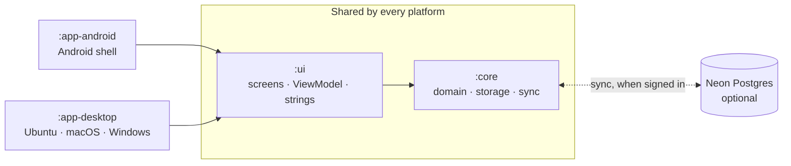

## Pick your path

| If you want to… | Start with |
|---|---|
| **get it running** and see where things live | [Quickstart](tutorials/quickstart.md) → [A tour of the code](tutorials/tour-of-the-code.md) |
| **make your first change** with a test and a pull request | [Your first contribution](tutorials/first-contribution.md) |
| **get one job done** — a schema change, a new string, a release | the [how-to guides](how-to/README.md) |
| **understand why** it is local-first, how sync merges, why recurrence is a chain of rows | [Concepts](concepts/README.md) |
| **look something up** — a table's columns, the backup format, a keyboard shortcut | [Reference](reference/README.md) |
| **know what was decided** and what it cost | [Decisions (ADRs)](adr/README.md) |

## Primico in four rules

Everything else in these pages follows from four decisions. Each one links to the page that
explains it.

1. **The SQLite database on the device is the truth.** The app is complete signed out and
   offline; an account only lets your own devices merge. → [Local-first](concepts/local-first.md)
2. **Nothing is deleted, only tombstoned; the newest write wins.** That is the whole sync
   protocol, and it is why every row carries `updatedAt` and `deletedAt`.
   → [How sync works](concepts/sync.md)
3. **Importance first, the due date breaks ties.** The one product rule every list is sorted by.
   → [Tasks, projects and tags](concepts/tasks-projects-tags.md)
4. **One codebase, two shells.** The domain and every screen are shared; Android and the desktop
   differ only in thin shells and a handful of ports.
   → [Architecture at a glance](concepts/architecture.md)

## What is where

- **[Tutorials](tutorials/README.md)** — learn by doing, one path that always works.
- **[How-to guides](how-to/README.md)** — recipes for a job you already understand.
- **[Concepts](concepts/README.md)** — the reasoning, the trade-offs, the diagrams.
- **[Reference](reference/README.md)** — schema, formats, grammar, shortcuts, configuration.
- **[Decisions](adr/README.md)** — the architecture decision records, oldest first.
- **[Plans](plans/README.md)** — what comes next and why in that order; the live list is the
  [issue tracker](https://github.com/viberfasend/primico/issues?q=is%3Aopen+label%3Apriority%3AP0%2Cpriority%3AP1),
  sorted by `priority:P0`–`P3`.

:::note[The code says Cadence]
The product is Primico; the Kotlin package, class names and persisted identifiers still say
`cadence`, on purpose. [Why](concepts/naming.md).
:::

These pages are Markdown in [`docs/`](https://github.com/viberfasend/primico/tree/main/docs),
built into this site by [`docs-site/`](https://github.com/viberfasend/primico/tree/main/docs-site).
To fix or add one, see [Write and preview the docs](how-to/write-docs.md).
