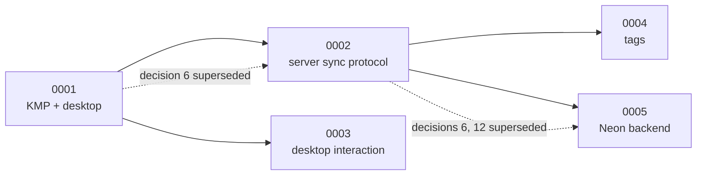

An ADR records one decision that is **expensive to reverse** or **invisible from the code**: why
there is no join table for tags, why sync pushes rows back to the server that just sent them.
The code tells you *what*; an ADR tells you *why not the obvious alternative*.

| ADR | Decision | Status | Date |
|---|---|---|---|
| [0001](0001-desktop-app-and-multi-device-sync.md) | Kotlin Multiplatform, SQLDelight, UUIDv7 ids and a desktop app built from shared `:core` and `:ui` modules | Accepted; phases 1–5 done, the synced-folder half superseded by 0002 | 2026-08-07 |
| [0002](0002-supabase-sync.md) | Sync through a server, hub and spoke, last writer wins, tombstones; the protocol still in use | Accepted; client and realtime superseded by 0005 | 2026-08-09 |
| [0003](0003-desktop-interaction-model.md) | The desktop is pointer- and keyboard-first: sidebar, two panes, drag and drop, command palette | Accepted | 2026-08-21 |
| [0004](0004-tags.md) | A tag is identity only; which tasks wear it is a packed column on the task | Accepted | 2026-08-22 |
| [0005](0005-neon-sync.md) | The sync backend moves from Supabase to Neon (Data API + Neon Auth), realtime becomes a poll | Accepted | 2026-08-25 |



## Numbers that are already spoken for

Planning notes and issues refer to ADRs that are not written yet. Since 0005 went to the Neon
move, these take the next free numbers **when the work starts**, in the order it starts — the
number is not reserved by the plan:

- the adaptive shell, one navigator on every platform ([#48](https://github.com/viberfasend/primico/issues/48));
- the `TaskQuery` grammar and where saved views are stored ([#149](https://github.com/viberfasend/primico/issues/149));
- how recurrence is drawn on a calendar ([#148](https://github.com/viberfasend/primico/issues/148));
- end-to-end encrypted sync ([#152](https://github.com/viberfasend/primico/issues/152)).

## Writing one

Copy the template below into `docs/adr/NNNN-short-slug.md` with the next free number, and open
it in the same pull request as the first code that depends on it.

- **An accepted ADR is not rewritten.** To change a decision, write a new ADR that supersedes it,
  and add one line to the old one's status pointing forward. The status line is the only part
  of an old ADR that changes.
- **An amendment** is for a narrow exception that leaves the decision standing — see
  [ADR 0002's amendment 1](0002-supabase-sync.md#amendment-1-2026-08-23-a-home-screen-widget-counts-as-somebody-looking).
- **Number the decisions** inside it (`### 1. …`), so code comments and other ADRs can cite
  "ADR 0004, decision 3".
- Write the rejected alternatives down with the reason. That section is what stops the same
  question being reopened in a year.

```md
---
title: "ADR NNNN — The decision, as a sentence"
sidebar:
  label: "NNNN · Short label"
  order: NNNN
---
**Status:** proposed | accepted | superseded by [ADR MMMM](MMMM-slug.md)
**Date:** YYYY-MM-DD
**Supersedes:** nothing | ADR MMMM decision N

## Context

What forces the decision now, and what it must not break.

## Decisions

### 1. The first decision

What we do, and why this and not the obvious alternative.

## Consequences

What gets easier, what gets harder, what we now have to keep true.

## Alternatives rejected

- **The alternative.** Why not.
```
