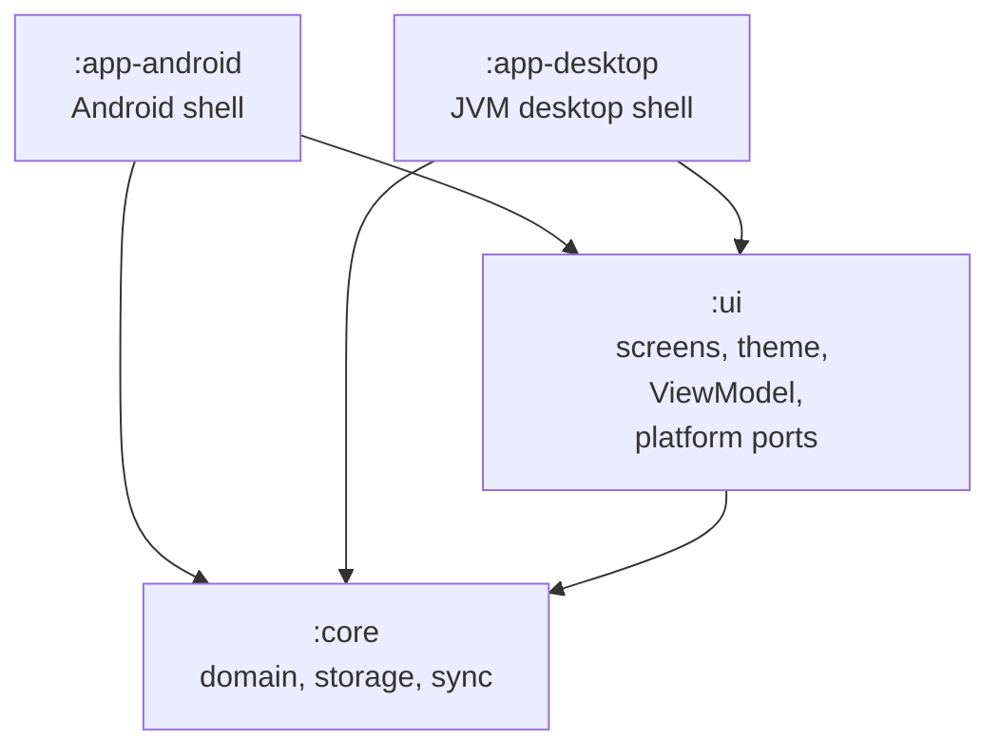
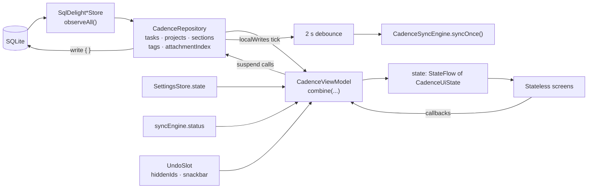

Primico is one Kotlin codebase with two thin shells: a domain module and a UI module that both
platforms share, and an Android app and a desktop app that each add only what their machine does
differently. Data flows one way — from SQLite, through a single repository and a single
ViewModel, into stateless screens — and every write goes back through the repository.

This page is the map. The other concept pages each take one part of it and explain why it looks
the way it does.

## Four modules, one direction

| Module | What lives there |
|---|---|
| [`:core`](../../core/) | The domain model, the recurrence and reminder rules, the quick-add parser, the backup codec, storage (SQLDelight) and the sync engine. No Compose. |
| [`:ui`](../../ui/) | Every screen, the theme, the formatters, the string resources, `CadenceViewModel` and the platform ports. Compose Multiplatform. |
| [`:app-android`](../../app-android/) | Navigation, notifications, `AlarmManager`, the Storage Access Framework, home-screen widgets. |
| [`:app-desktop`](../../app-desktop/) | The window, the sidebar and two-pane layout, keyboard shortcuts, the tray icon, a JSON settings file. |

Nothing points upward: `:core` does not know Compose exists, and `:ui` does not know which shell
it is running in. The full inventory is in [Modules](../reference/modules.md); the history of how
the single Android app was split up is [ADR 0001](../adr/0001-desktop-app-and-multi-device-sync.md).

## Ports and adapters

Wherever Android and the desktop genuinely differ, the shared code states what it needs as an
interface — a *port* — and each shell supplies an implementation — an *adapter*. There are two
families of them.

**Store ports, in `:core`.** [`Stores.kt`](../../core/src/jvmShared/kotlin/de/andi1984/cadence/data/Stores.kt)
declares `TaskStore`, `ProjectStore`, `SectionStore`, `TagStore`, `AttachmentStore`,
`BackupStore` and `StoreTransaction`. They speak `Task` and `Project`, not rows, and carry no
database annotation. There is exactly one adapter for each —
[`SqlDelightStores.kt`](../../core/src/jvmShared/kotlin/de/andi1984/cadence/data/db/SqlDelightStores.kt)
— because SQLDelight is itself multiplatform. The ports are kept for their vocabulary, not so
that a test can swap in a fake (see [Testing philosophy](testing-philosophy.md)).

**Platform ports, in `:ui`.** [`ui/platform/Ports.kt`](../../ui/src/jvmShared/kotlin/de/andi1984/cadence/ui/platform/Ports.kt)
declares `ReminderScheduler`, `BackupGateway`, `BackupFilePicker`, `AttachmentFilePicker` and
`AttachmentOpener`; `SettingsStore` sits next to the settings types in
[`ui/settings/SettingsStore.kt`](../../ui/src/jvmShared/kotlin/de/andi1984/cadence/ui/settings/SettingsStore.kt).

| Port | Android adapter | Desktop adapter |
|---|---|---|
| `ReminderScheduler` | `AlarmReminderScheduler` (exact alarms) | `DesktopReminderScheduler` (30 s poll, tray balloon) |
| `BackupGateway` | `BackupIo` | `DesktopBackupIo` |
| `BackupFilePicker` | `rememberSafBackupFilePicker` (SAF) | `DesktopBackupFilePicker` |
| `AttachmentOpener` | `AndroidAttachmentOpener` (`FileProvider`) | `DesktopAttachmentOpener` (`java.awt.Desktop`) |
| `SettingsStore` | `SharedPrefsSettingsStore` | `DesktopSettingsStore` (`settings.json`) |

### Why sync is not a port

HTTPS and JSON are the same on both platforms, so
[`CadenceSyncEngine`](../../core/src/jvmShared/kotlin/de/andi1984/cadence/data/sync/CadenceSyncEngine.kt)
is a concrete class in `:core`, built once and shared by both shells. A port is for what the
*machine* does differently — alarms, a file chooser, a content URI — and a network request is not
that ([ADR 0002, decision 7](../adr/0002-supabase-sync.md#7-the-sync-client-lives-in-core-and-is-not-a-port)).

## One ViewModel, one state

There is exactly one ViewModel for the whole app,
[`CadenceViewModel`](../../ui/src/jvmShared/kotlin/de/andi1984/cadence/ui/CadenceViewModel.kt),
and it exposes exactly one `StateFlow<CadenceUiState>`. Every screen is a stateless composable
that receives that whole state plus callbacks. No screen loads its own data.

Reading the diagram from the top:

1. Each store exposes a `Flow` over a SQLDelight query. `CadenceRepository` re-exports them as
   `tasks`, `projects`, `sections`, `tags` and `attachmentIndex`.
2. The ViewModel `combine`s those with the settings, the sync status and the undo slot into one
   `CadenceUiState`. Because `combine` has typed overloads for at most five flows, the inputs are
   folded into small private groups first (`Records`, `Transient`) — a detail you will meet the
   moment you add a sixth.
3. Derived views — the Inbox, overdue tasks, a project's tasks, a tag's tasks — are methods on
   `CadenceUiState`, backed by `by lazy` indexes built once per emission. **A new derivation goes
   there**, not into a screen.
4. A callback calls a ViewModel method, which launches a repository call. Every mutating
   repository method routes its write through a private `write { }` wrapper, which ticks
   `localWrites` when the write succeeds.
5. The ViewModel debounces `localWrites` by two seconds and runs a sync round. A row merged in by
   a pull never passes through the repository, so it can never tick `localWrites` — which is
   what keeps two devices from waking each other forever. [Sync](sync.md) has the rest.

### Why a plain class and not an Android ViewModel

The desktop has no `androidx.lifecycle`. The only two things Android needs from it are a scope
that survives a rotation and a moment to stop, so `CadenceViewModel` takes a `scope` in its
constructor and has a `close()` method. On Android,
[`CadenceViewModelHost`](../../app-android/src/main/java/de/andi1984/cadence/ui/CadenceViewModelHost.kt)
is an `androidx.lifecycle.ViewModel` whose whole body is one field, built from
`viewModelScope`. On the desktop, `main()` creates a plain `CoroutineScope` and calls `close()`
from the window's `onCloseRequest`.

## Wiring without a DI framework

The dependency graph is written by hand, in three places.

- [`CadenceCore`](../../core/src/jvmShared/kotlin/de/andi1984/cadence/data/CadenceCore.kt) builds
  what both shells share: the database, the blob store, `CadenceRepository` with its stores and
  `StoreTransaction`, `CadenceSyncEngine`, and the application scope they run on. A store a new
  feature adds is one line here.
- Each shell has an `AppContainer` that opens the database driver (the one genuinely
  platform-specific step — `DatabaseDriverFactory` takes a `Context` on Android and a `File` on
  the desktop), constructs `CadenceCore`, and builds its own adapters into a
  `ViewModelAdapters`. Android's lives in
  [`AppContainer.kt`](../../app-android/src/main/java/de/andi1984/cadence/AppContainer.kt) and is
  created in `CadenceApplication.onCreate`; the desktop's,
  [`AppContainer.kt`](../../app-desktop/src/main/kotlin/de/andi1984/cadence/desktop/AppContainer.kt),
  is constructed once at the top of `main()`.
- [`cadenceViewModel(core, adapters, scope)`](../../ui/src/jvmShared/kotlin/de/andi1984/cadence/ui/CadenceViewModelFactory.kt)
  assembles the seven-argument ViewModel constructor once, so neither shell repeats it.

The rule for where a new singleton goes: shared by both shells → `CadenceCore`; genuinely
platform-specific (SharedPreferences, AlarmManager, a tray icon) → the shell's `AppContainer`.

:::note[Why no DI framework?]
The graph is a couple of dozen objects, built once, never scoped per screen. A framework would add
annotation processing to both shells to generate code that is shorter to write by hand — and the
hand-written version is readable top to bottom in `CadenceCore`.
:::

## `jvmShared`, not `commonMain`

`:core` and `:ui` are Kotlin Multiplatform modules with an **android** and a **jvm** target, but
their hand-written code lives in a hand-declared `jvmShared` source set that both targets depend
on — not in `commonMain`. Both targets *are* the JVM, so `jvmShared` may use the JDK, and that is
why the recurrence engine still speaks `java.time` rather than `kotlinx-datetime`.

`commonMain` holds only what is generated or genuinely portable: SQLDelight's query code, and
`:ui`'s string resources. It starts to earn its keep the day a browser target exists; moving code
there before then would buy portability nothing needs, at the price of rewriting every date in
the app ([ADR 0001, decision 3](../adr/0001-desktop-app-and-multi-device-sync.md#3-javatime-stays-until-a-browser-target-needs-otherwise)).

The one `expect`/`actual` pair is `DatabaseDriverFactory`: its `androidMain` actual takes a
`Context` and its `jvmMain` actual takes a data directory, and the `expect` declares no
constructor so neither has to match the other.

:::caution[Smart casts stop at the module boundary]
`if (task.dueDate != null) task.dueDate.isAfter(…)` compiles inside `:core` and fails in `:ui`,
because `Task` is declared in another module. Bind a local (`val due = task.dueDate`) or use
`task.dueDate?.isAfter(today) == true` rather than reaching for `!!`.
:::

## Where to go next

- [Local-first](local-first.md) — why the device's database is the truth and the server is optional.
- [Sync](sync.md) — how a round pulls, merges and pushes, and when rounds run.
- [Recurrence](recurrence.md) — a recurring task as a chain of rows.
- [Tasks, projects and tags](tasks-projects-tags.md) — the organising model and the sort rule.
- [Reminders](reminders.md) — one planner, one reconciler, two platform schedulers.
- [Undo and deletes](undo-and-deletes.md) — deferred writes and tombstones.
- [Attachments](attachments.md) — the row is the truth, the blob is a cache.
- [The desktop shell](desktop-shell.md) — sidebar, two panes, drag and drop, the keyboard.
- [Testing philosophy](testing-philosophy.md) — real stores, fake platform ports, no mocks.
- [Naming](naming.md) — why the product is Primico and the code says Cadence.

## Related

- [Tour of the code](../tutorials/tour-of-the-code.md)
- [Modules](../reference/modules.md)
- [Add a platform port](../how-to/add-a-platform-port.md)
- [Add a mutation](../how-to/add-a-mutation.md)
