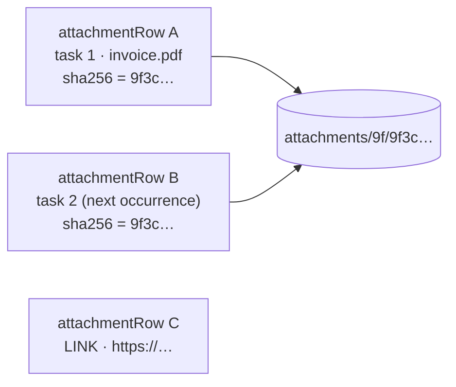

An attachment is a **local fact**. Its row in `attachmentRow` is the truth of "the user attached
this"; the bytes, for a file, are a **cache** stored once per SHA-256 under the app's data
directory. A row whose bytes are missing is not an error — it is a state the UI draws and offers
to heal.

Attachments are neither synced nor in the backup file yet. The full design, including the
Android share sheet still to come, is [Attachments and the share sheet](../attachments-and-share.md);
this page explains the parts that have shipped.

## Two kinds

An [`Attachment`](../../core/src/jvmShared/kotlin/de/andi1984/cadence/domain/model/Attachment.kt)
is either a **LINK** — a URL, no bytes — or a **FILE**, which carries a name, a MIME type, a
size and the SHA-256 of its content. A task holds at most 20, and a file may be at most 25 MB.

## Content-addressed blobs

[`BlobStore`](../../core/src/jvmShared/kotlin/de/andi1984/cadence/data/BlobStore.kt) stores bytes
under their own hash, at `attachments/<first two hex chars>/<sha256>`. A copy is streamed into
`attachments-tmp/` while being hashed, then renamed into place — both directories are siblings,
because a rename is only atomic within one filesystem.

**Why content addressing?** Two rows naming the same hash *is* the dedupe. A recurring task hands
its attachments to the next occurrence by cloning rows, not bytes; the same file attached twice
is stored once.

**Why no refcount column?** The attachments table already is one. A blob is garbage the moment no
row names it, and `CadenceRepository.reclaim` asks `AttachmentStore.stillReferenced` rather than
trusting a stored counter that could drift. Every delete path reclaims after its transaction, and
`sweepOrphanBlobs()` runs once at start-up (from `CadenceCore`) and after an import, healing any
blob a killed process left behind.

## A missing blob is a state, not an error

A backup restored without its files, a second device that has never seen the file, a process
killed mid-copy: the row survives and the bytes are gone. The attachment card greys the entry,
says it is not on this device, and offers **Find file**.

`CadenceRepository.relocateAttachment` heals the row *in place* — same id, same name, same task —
with whatever bytes the user points at, **even if they hash differently**. A re-exported bank
statement is a different file with the same meaning; refusing it would leave the row broken
forever to protect a hash nobody promised.

## Presence is read once per emission

Screens must never touch the filesystem while drawing: a list asking "is this file here?" per row
per frame would stat the same directory a hundred times a second.

So [`CadenceRepository.attachmentIndex`](../../core/src/jvmShared/kotlin/de/andi1984/cadence/data/CadenceRepository.kt)
pairs the attachment rows with the set of hashes present on disk, checking each *distinct* hash
once per emission, and `CadenceUiState.isPresent(attachment)` answers from that set. The rows and
the presence set travel as **one value**, `AttachmentIndex`, so they can never be drawn
half-updated — a new row next to a presence set from before it existed would flash as missing.

## Blob I/O is dispatched by the repository

Every store port dispatches its own I/O. `BlobStore` is plain `java.io` with no dispatcher, and a
25 MB copy on Android's ViewModel scope would be a frozen UI. So `CadenceRepository` takes an
`ioDispatcher` and wraps every blob call in `withContext(ioDispatcher)`, and `attachmentIndex`
runs under `flowOn(ioDispatcher)`. Tests pass `Dispatchers.Unconfined`, for the same reason the
SQLDelight stores take one: a real dispatcher would put the state flow on a thread `runTest`'s
virtual clock does not control ([Testing philosophy](testing-philosophy.md)).

## Opening a file

Opening goes through the `AttachmentOpener` port, which answers whether anything took the file,
so a screen can say "no app can open this" instead of looking broken.

- **Android** hands the blob out through a `FileProvider`, and only the blob directory:
  [`attachment_paths.xml`](../../app-android/src/main/res/xml/attachment_paths.xml) declares
  `attachments/` alone — not `files/`, which holds the database, and not the staging directory.
  A file under `filesDir` is unreadable to other apps, and a `file://` URI throws since Android 7.
- **The desktop** hands the file to `java.awt.Desktop`, guarded so that a headless run opens
  nothing and says so.

## Thumbnails, hand-rolled

[`AttachmentThumbnail.kt`](../../ui/src/jvmShared/kotlin/de/andi1984/cadence/ui/attachments/AttachmentThumbnail.kt)
decodes images with Compose Multiplatform's `ByteArray.decodeToImageBitmap()`, which is already on
the classpath for the string resources, so `:ui` needs no `expect`/`actual`. That decoder has no
`inSampleSize`, so a source over 4 MB is not decoded — the row draws its MIME icon instead — and
decoded thumbnails sit in a small LRU cache bounded by bytes.

**Why not Coil?** One call site does not justify an image-loading library; the one thing Coil
would genuinely add is EXIF rotation, and that is a much smaller dependency if photos come out
sideways.

## Not synced, not backed up — yet

Neither kind is in the sync wire shape (`RemoteRecords.kt`) or in the backup file, so **no
attachment write ticks `localWrites`** — there is nothing for a round to push. This is also why
`attachmentRow → taskRow` is the one foreign-key cascade left in the schema: attachment rows are
never merged, and nothing references them back.

What that costs today: attachments stay on the device that added them. A second device sees the
task without its files. The bundle export that carries attachments in a backup is phase 4 of
[the design](../attachments-and-share.md#g-phases).

## Related

- [Attachments and the share sheet](../attachments-and-share.md) — the full design and its phases
- [Recurrence](recurrence.md#what-the-next-occurrence-inherits)
- [Undo and deletes](undo-and-deletes.md)
- [Database](../reference/database.md)
