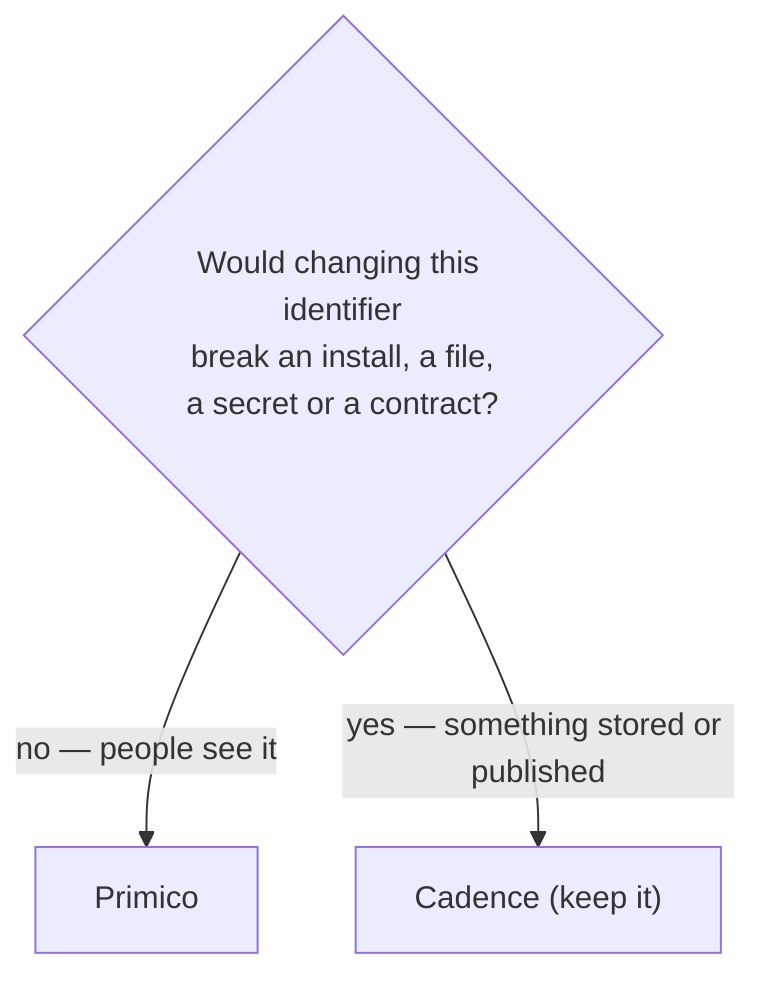

The product is **Primico**. The code still says **Cadence**, on purpose. Everything a person sees
was renamed; everything that is a persisted identity or a published contract kept the old name,
because changing it would cost users something and gain them nothing.

## What happened

The app was called Cadence until version 3.x. On 2026-09-14 it was renamed Primico — an unrelated
app, "Cadence: Aufgaben & Todo", had reached the App Store first. The rename landed as a single
breaking change, [#211](https://github.com/viberfasend/primico/pull/211).

## The rule

> **If a person can see it, it says Primico. If a machine has stored it or another program
> depends on it, it says Cadence.**

### Renamed to Primico

- App names, the launcher label, the desktop window title and tray balloons
- Desktop package names and release asset names — and so the permanent download URLs
- The website and these docs
- The desktop **data directory**: `primico` on Linux, `Primico` on macOS and Windows

### Kept as Cadence

| Identifier | Why it stays |
|---|---|
| Kotlin package `de.andi1984.cadence` and the Android application id | The application id *is* the app to Android. Changing it means a fresh install for every user, with their data left behind in the old one. |
| Class names — `CadenceViewModel`, `CadenceRepository`, `CadenceCore`, `CadenceSyncEngine`, … | Churn across every file, no user-visible gain, and every ADR and issue would stop matching the code. |
| `CADENCE_*` environment variables and CI secrets | Build scripts, forks and repository secrets already use them. |
| `"format": "cadence.backup"` in backup files | A published contract: existing backup files, and any program that reads them, identify the format by this string. |
| `cadence.db`, the database file name | A file already on every device. |
| The macOS bundle id and the Windows installer upgrade UUID | The operating system uses them to recognise an upgrade as the same app. A new one installs a second copy. |

:::tip[Adding something new?]
A new *user-visible* string says Primico. A new class, package or environment variable follows
the code around it — `Cadence…` and `CADENCE_…` — so the codebase stays consistent with itself.
Don't "finish the rename" in code; that churn was considered and rejected.
:::

## Moving the desktop data directory

The one persisted location that *was* renamed is the desktop data directory, because people find
it in their file manager. That needed a migration, and it lives in
[`PlatformDirs.dataDir()`](../../app-desktop/src/main/kotlin/de/andi1984/cadence/desktop/platform/PlatformDirs.kt):

1. Work out the parent — `$XDG_DATA_HOME` or `~/.local/share` on Linux,
   `~/Library/Application Support` on macOS, `%APPDATA%` on Windows.
2. If the new `primico`/`Primico` directory does not exist **and** the old `cadence`/`Cadence`
   directory does, rename the old one to the new name. Same parent, so the rename is atomic.
3. If that rename fails, **keep using the old directory** rather than greeting the user with an
   empty list next to a full database.

Inside it, the files keep their names: `cadence.db`, `settings.json`, `workspace.json` and the
`attachments/` blob store. Android needs no migration — `Context.filesDir` belongs to the
application id, which did not change.

## Reading older material

The ADRs are history and are not rewritten: they say Cadence throughout, and so do issues and pull
requests from before the rename. When an ADR names `CadenceRepository`, it means the class that
still has that name today.

## Related

- [Architecture at a glance](architecture.md)
- [Configuration](../reference/configuration.md) — the `CADENCE_*` variables
- [Backup format](../reference/backup-format.md) — the `cadence.backup` contract
- [Glossary](../reference/glossary.md)
