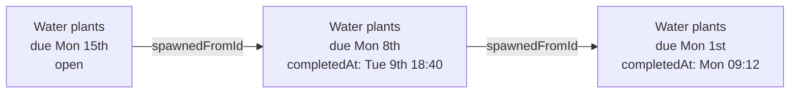
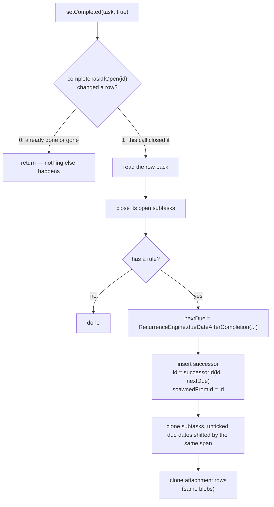

A recurring task is not one row whose due date moves. It is a **chain of rows**: completing an
occurrence keeps the finished row exactly where it is and inserts a new row for the next one,
linked back by `spawnedFromId`. Everything else on this page — idempotent completion, one
transaction, reopening, the lists that hide history — follows from that choice.

## The chain

Each row is an ordinary `Task` with the same title, project, priority, tags and rule. The only
link between two of them is
[`Task.spawnedFromId`](../../core/src/jvmShared/kotlin/de/andi1984/cadence/domain/model/Task.kt):
"this row replaces that finished occurrence".

### Why rows and not a moving date?

- **History stays true.** Today can show "Done 09:12" on the finished occurrence for the rest of
  the day, and Search can find last month's completions, because they are real rows with a real
  `completedAt`.
- **Sync stays row-shaped.** A completion is two row writes that merge like any others. A moving
  date would make "completed Monday's instance" and "edited the rule" the same write to the same
  row, and last-writer-wins would drop one of them.
- **Two devices converge.** The successor's id is derived, not random —
  `UuidV7.successorId(current.id, nextDue)` — so two devices completing the same occurrence
  offline both insert *the same* row, and the merge collapses them
  ([Local-first](local-first.md#successor-ids-are-derived)).

The rule itself is a
[`RecurrenceRule`](../../core/src/jvmShared/kotlin/de/andi1984/cadence/domain/model/Recurrence.kt):
either a calendar schedule (`SCHEDULE` — "every 3 months on the last weekday") or anchored to the
completion (`AFTER_COMPLETION` — "3 days after done"). It is stored packed in one TEXT column by
`RecurrenceCodec`, so adding a rule field means extending the codec, not adding a column.

## Completing an occurrence

[`CadenceRepository.setCompleted`](../../core/src/jvmShared/kotlin/de/andi1984/cadence/data/CadenceRepository.kt)
does all of this in one call:

Everything from the first box down runs inside a single `storeTransaction.run { … }`.

### Completing must be idempotent

Every caller passes a `Task` the UI drew a row from, and a checkbox tapped twice before the list
recomposes hands back the **same open snapshot** both times. If completion trusted that snapshot,
two taps would schedule two successors.

So closing the row is left to the store: `completeIfOpen` in
[`Task.sq`](../../core/src/commonMain/sqldelight/de/andi1984/cadence/data/db/Task.sq) is an
`UPDATE` guarded by `completedAt IS NULL AND deletedAt IS NULL`, and the store reads SQLite's
`changes()` back on the same connection to learn whether *this* statement changed a row. Only the call that actually closed it goes on to insert the successor,
and it reads the row back rather than trusting the snapshot — the rule, due date or project may
have been edited since the row was drawn, and the next occurrence inherits all of them. Do not
replace it with a plain `update`.

### Closing and inserting are one write

Closing the row, finishing its subtasks, inserting the successor, cloning its checklist and
attachments — these used to be separate writes. A process killed between "closed" and "successor
inserted" left a completed row with no successor: the recurrence silently ended. Now they commit
together or not at all.

The seam for that is
[`StoreTransaction`](../../core/src/jvmShared/kotlin/de/andi1984/cadence/data/Stores.kt), and its
block runs against a `TransactionScope`, not the ordinary store ports.

#### Why `TransactionScope` is not `suspend`

The ordinary ports (`TaskStore`, `AttachmentStore`, …) are `suspend`. The transaction block is
not, and neither is anything reachable from it. SQLDelight's transaction callback is a plain
`() -> T`: a store call that genuinely suspended inside it would not "come back later" inside the
transaction — the callback would already have returned, and the suspended coroutine's writes
would land after, and outside, the transaction that gave up on it. An earlier version bridged the
gap with a coroutine intrinsic; `CadenceViewModelUndoTest`'s in-flight-delete case caught exactly
that. `TransactionScope`'s members are plain functions over the generated `Queries` objects, so
the mistake is now impossible to write.

The recurrence and subtask *rules* stay in the repository. Only how their writes land changed.

## Completing late

[`RecurrenceEngine.dueDateAfterCompletion`](../../core/src/jvmShared/kotlin/de/andi1984/cadence/domain/recurrence/RecurrenceEngine.kt)
decides the next due date:

- **Completed on the day, or early** — step once from the occurrence's own due date. A Monday task
  done on Monday is next due the following Monday.
- **Completed late** — keep stepping the rule forward past every occurrence that is already
  behind the completion day. A daily task ticked off a month late is due *today*; a Monday task
  done the following Wednesday is due next Monday.
- **`AFTER_COMPLETION` rules** — step from the completion day itself.

An overdue occurrence therefore hands over to the first one that is not behind you.

### The removed `keepMissed` flag

There used to be a `RecurrenceRule.keepMissed` — "skipped ones stay overdue", stepping once no
matter how far behind. It was written as an explicit `true` into every rule created before
mid-August 2026 and by every Todoist import, so flipping its default never reached the rules
that actually existed. It was removed outright. The three decoders — `RecurrenceCodec`,
`BackupCodec` and `RemoteRecords` — ignore the segment, key or column a stored rule may still
carry.

## Reopening undoes both halves

`setCompleted(task, false)` reopens the row with `reopenIfDone` — the mirror of `completeIfOpen`,
idempotent the same way — and then tombstones the occurrence its completion inserted
(`openSuccessorsOf`). Without that second half the task would stand in the list twice. A
successor that has itself been ticked off is left alone: the chain has moved past it.

Both halves share one transaction for the mirror reason: a kill between "reopened" and "successor
removed" used to leave the task duplicated. `setCompleted` returns the ids it deleted so the
ViewModel can cancel their reminders — the scheduler only ever sees tasks that still exist.

## What the next occurrence inherits

| | Carried to the successor? |
|---|---|
| Title, notes, priority, project, section, time, reminder, rule | Yes — the successor is a copy of the row as stored |
| Tags | Yes |
| Subtasks | Yes, **unticked**, with their due dates shifted by the same number of days as the parent's; ids derived from the parent's successor id plus their own |
| Attachments | Yes — the *rows* are cloned; the bytes are not, since two rows naming one hash is the dedupe |

A checklist is the method of doing the task, and the method repeats.

## Which lists show history

A daily task completed for a month is thirty completed rows and one open one.

- **Undated lists — the Inbox, a project — show the chain as one task.**
  `CadenceUiState.rootTasks()` drops a completed occurrence that has been replaced
  (`withoutSupersededOccurrences()` in `Task.kt`). The last row of a chain always stays, so
  finishing a recurring task for good does not make it vanish.
- **Today and Upcoming** read `state.tasks` directly, because they filter by date anyway.
- **Search** reads `state.tasks` directly because it is meant to reach history.

## Related

- [Tasks, projects and tags](tasks-projects-tags.md)
- [Local-first](local-first.md)
- [Quick add](../reference/quick-add.md) — how "every monday at 9am" becomes a rule
- [Data model](../reference/data-model.md)
- [ADR 0001, decision 4](../adr/0001-desktop-app-and-multi-device-sync.md#4-identifiers-become-uuidv7)
