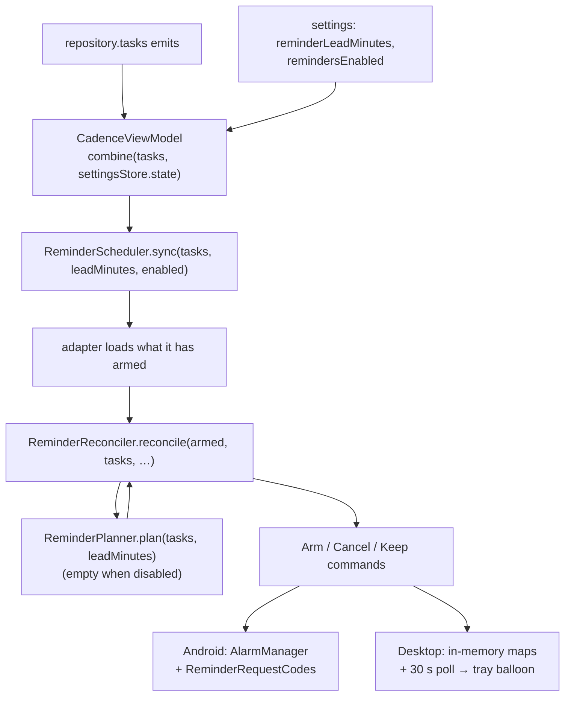

Reminders are **reconciled, not scheduled**. Every time the task list or the settings change, the
whole list goes to the platform's `ReminderScheduler`, and two pure functions in `:core` decide
what that means: [`ReminderPlanner`](../../core/src/jvmShared/kotlin/de/andi1984/cadence/domain/reminder/ReminderPlanner.kt)
answers *when* each task should notify, and
[`ReminderReconciler`](../../core/src/jvmShared/kotlin/de/andi1984/cadence/domain/reminder/ReminderReconciler.kt)
answers *what to change* compared with what is already armed. Each shell's scheduler is left with
only the platform calls.

## The flow

The ViewModel starts that collector in its `init`; the only other caller of `sync` is Android's
`BootReceiver`, which rebuilds the alarms after a reboot. The one other entry point is `ReminderScheduler.cancel(taskId)`, for a row that is about to stop existing: once
a task is deleted, `sync` never sees it again and could not cancel its alarms. That is why
`setCompleted`, `deleteTask`, `deleteProject` and the danger-zone wipe all return the ids they
removed.

## When: the planner

For each task that is open and has a due date, `ReminderPlanner.plan` produces
`ReminderInstant(taskId, leadMinutes, triggerAt)` values from two independent sources:

- **`dueTime` × lead minutes.** One instant per positive entry in
  `CadenceSettings.reminderLeadMinutes`, counted back from the due time. Quick add's "18 Uhr"
  already fills in `dueTime`, so this list is what turns a typed time into a notification.
- **`reminderTime`.** The older, manually picked exact-time reminder, independent of `dueTime`.
  It fires once, reported with lead `0`.

### Several reminders per task

`reminderLeadMinutes` is a *list* — Settings → *Notify me before* offers a chip per preset plus a
custom value — so `[20, 10, 5]` posts three notifications. It is **empty by default**: a fresh
install, or an upgrade over tasks that already carry due times, must not start notifying for
something nobody configured.

Because a task can carry several alarms, an alarm's identity is a
**`ReminderKey(taskId, leadMinutes)`** pair, not a task id.

### Why the planner does not filter by "now"

The two platforms disagree on what a past instant means. `AlarmManager` cannot fire
retroactively, so Android discards it. The desktop has no such limit and fires it on the next
poll — a reminder that came due while the app was closed is still wanted. Filtering in the
planner would take that behaviour away from the desktop to give Android something it already
does for itself.

## What to change: the reconciler

`ReminderReconciler.reconcile` diffs the armed set against the plan and returns commands:

| Situation | Command |
|---|---|
| Planned, not armed — or armed at a different instant | `Arm` |
| Planned and armed at the same instant | nothing at all |
| Armed, no longer planned, trigger still in the future | `Cancel` |
| Armed, no longer planned, trigger passed **less than `grace` ago** | `Keep` |
| Armed, no longer planned, trigger passed longer ago | `Cancel` |

Three properties fall out of that table:

- **It is idempotent.** The same input twice produces no commands, so running it on every task
  emission is cheap and safe — and it is what stops the desktop from firing a reminder twice.
- **"Reminders off" is an empty plan.** `enabled = false` makes every armed key "no longer
  planned", so switching reminders off cancels everything this device had armed. It used to be
  done by stripping the times off every task before the call, which the scheduler could not tell
  from "no reminder set".
- **It diffs against the whole armed set**, so a task that vanished without a `cancel` — one a
  pull tombstoned, say — loses its alarms on the next emission too.

### The grace rule

An alarm whose trigger just passed may still be on its way. Cancelling it inside that window
takes the notification away unfired; re-arming a past trigger would fire it again at once. So an
armed alarm nothing plans any more, whose trigger passed less than `grace` ago, is left alone.
The worst case is a late notification for a reminder that was just cleared — the smaller harm.

Android's grace is **ten minutes**. The desktop's is **zero**: a poll has no delivery latency to
wait out.

## Android: exact alarms

[`AlarmReminderScheduler`](../../app-android/src/main/java/de/andi1984/cadence/reminders/AlarmReminderScheduler.kt)
applies `Arm` with `setExactAndAllowWhileIdle`, falling back to `setAndAllowWhileIdle` when
`canScheduleExactAlarms()` says the user revoked exact-alarm access. The manifest declares
`USE_EXACT_ALARM` (granted at install on Android 13+, no prompt) and `SCHEDULE_EXACT_ALARM` for
12 and 12L.

### Why not inexact alarms, which need no permission?

That was the first version: `setWindow` with a ten-minute window. It cost the lead-minutes
feature its first release. A "5 minutes before" alarm with a ten-minute window can land after the
task is due. Worse, an inexact alarm is *deferred outright* while the phone dozes — the one state
a reminder exists to interrupt — so it arrived at the next maintenance window, by which time its
trigger was in the past and the next `sync` cancelled it unfired. The grace rule above is the
other half of that fix.

Two more Android details:

- An `Arm` naming a past instant cannot be honoured, so the adapter drops it and settles whatever
  was armed under that key with `ReminderReconciler.retire` — the same grace rule.
- [`ReminderRequestCodes`](../../app-android/src/main/java/de/andi1984/cadence/reminders/ReminderRequestCodes.kt)
  maps each key to a stable `PendingIntent` request code and persists the armed set with its
  instants. Lead `0` keeps the bare-task-id code it always had, so upgrading changes nothing for
  an existing alarm. Cancelling looks up an *existing* code and never mints one, so a task
  without a time never grows the store. `BootReceiver` re-runs `sync` with the same `enabled`
  flag after a reboot.

## Desktop: a poll and a tray balloon

The desktop has no `AlarmManager`.
[`DesktopReminderScheduler`](../../app-desktop/src/main/kotlin/de/andi1984/cadence/desktop/data/DesktopReminderScheduler.kt)
keeps the armed set in memory, polls it every **30 seconds**, and shows a system-tray balloon for
anything that has come due and has not fired yet. It only works while the app is running — the
same accepted trade-off
[ADR 0001](../adr/0001-desktop-app-and-multi-device-sync.md#8-desktop-specifics) names for a
killed Android process.

## Reminders are per device

`CadenceSettings.remindersEnabled` is a per-device setting, **on by default on Android and off on
the desktop** — each shell's `SettingsStore` supplies the default, since that is the only thing
that differs. Once a task exists on both devices, both would otherwise go off for it at the same
minute ([ADR 0002, decision 9](../adr/0002-supabase-sync.md#9-reminders-become-a-per-device-setting)).

**Why not a synced "already fired" marker?** It would need both devices online exactly when the
reminder is due, which is when the desktop is most likely closed. A missed reminder is worse than
a doubled one.

## Related

- [Architecture at a glance](architecture.md)
- [Quick add](../reference/quick-add.md) — how "18 Uhr" becomes a `dueTime`
- [Configuration](../reference/configuration.md)
- [Testing philosophy](testing-philosophy.md) — `DesktopReminderSchedulerTest` and the `backgroundScope` rule
