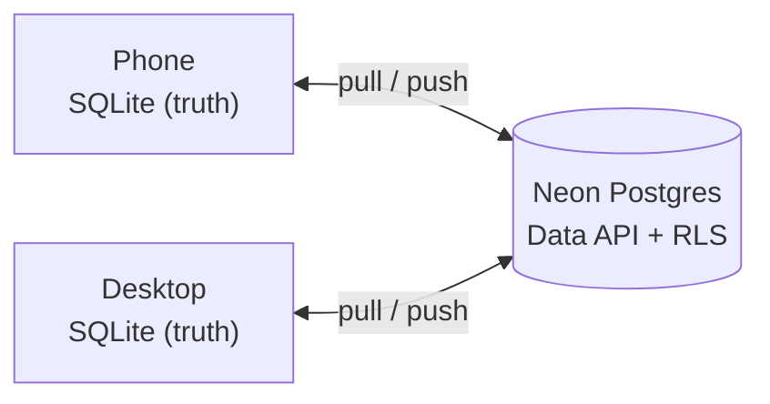
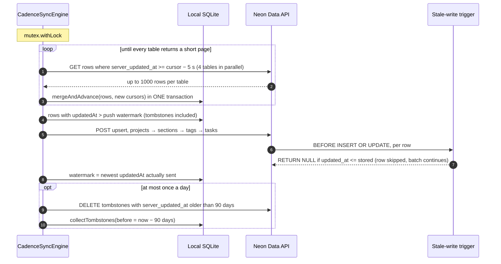

Sync keeps one person's devices in step through a hosted Postgres that acts as a hub. Each device
keeps its whole database; a **round** pulls what changed on the server since the last round,
merges it locally under last-writer-wins, pushes what changed locally, and occasionally
collects old tombstones. Every step is idempotent, so any failure means "stop, try again later" —
and nobody ever presses a button to make it happen.

The protocol is [ADR 0002](../adr/0002-supabase-sync.md)'s; the backend is Neon since
[ADR 0005](../adr/0005-neon-sync.md). All of it lives in one class,
[`CadenceSyncEngine`](../../core/src/jvmShared/kotlin/de/andi1984/cadence/data/sync/CadenceSyncEngine.kt),
with two small helpers for auth and HTTP.

## Hub and spoke

Devices never talk to each other. The server holds four tables — `tasks`, `projects`, `sections`,
`tags` — with forced row-level security over `auth.user_id()`, so an account only ever sees its
own rows. There is no API key in the design: the credential is the account. The schema and its
trigger are in [`neon/migrations/`](../../neon/migrations/); the wire shape is in
[Sync wire format](../reference/sync-wire.md).

## Anatomy of a round

`syncOnce()` takes a `Mutex`, so two rounds never interleave, and then runs pull → push → sweep.

### Pull

The engine keeps one cursor per table in `syncStateRow`. It asks for rows at or after each cursor,
the four tables in parallel, a page of up to 1000 at a time, and hands each page to
`SyncStore.mergeAndAdvance`, which merges the rows **and** advances the cursors inside one
transaction. A crash between the two cannot leave a cursor past rows that were never merged.

The merge is per record, keyed by id: the greater `updatedAt` wins the whole record, ties keep
what is stored, and a tombstone competes like any other version. There is no field-level merge.

### Push

Everything with `updatedAt` above the **push watermark** goes up, tombstones included, as a
PostgREST upsert in batches of 500 — in reference order (projects, sections, tags, tasks), so a
reader between two batches never sees a task pointing at a project it has not been sent yet.

### Sweep

After a successful round, at most once a day, the engine deletes tombstones older than 90 days —
on the server first through four Data API `DELETE`s, then locally. Server first on purpose: if
the server sweep fails, the round fails and is retried, so the local copy is never collected
before the server's.

## The five rules that make it safe

**1. The cursor is the server's clock; the merge is the device's.** Pulls filter on
`server_updated_at`, which only the server's trigger writes. A device whose clock is wrong can
lose a conflict, but it can never make its rows invisible to the other device. Conflicts, on the
other hand, are decided by `updatedAt`, the device's own stamp of when the edit happened.

**2. The pull re-reads a five-second overlap.** Postgres's `now()` is the *transaction start*
time, so a transaction that began before ours and committed after it can land behind a cursor we
already advanced past. Re-reading a little is free — the merge discards what it already has —
and missing a row is not.

**3. There is no `dirty` column; the server makes that safe.** A row that arrived *from* the
server has a fresh local write time and sits above the watermark, so it gets pushed straight
back. The server's `reject_stale_*` trigger sees an `updated_at` that is not strictly greater
than what it stores and returns `NULL`, which skips that one row without failing the batch.

**4. The new watermark is the newest `updatedAt` actually sent, never "now".** A row written
while the push was in flight has a stamp above that and waits for the next round, instead of
being skipped by a clock that ran ahead of the data.

**5. Timestamps are truncated to milliseconds, everywhere.** Local storage is epoch millis and
Postgres is microseconds. Without truncation a row pushed and pulled back returns strictly newer
than its local copy, overwrites it, gets pushed again — forever. `CadenceRepository.now()` and
the wire DTOs both truncate
([ADR 0002, decision 8](../adr/0002-supabase-sync.md#8-timestamps-truncate-to-milliseconds)).

### Why last-writer-wins and not a CRDT?

A todo list's conflicts are rare and small: the same task edited on two devices within one
offline window. Last-writer-wins resolves every one of them deterministically with one timestamp
per row and one rule shared by the device, the server trigger and the backup import. The cost is
real and stated: two devices editing *different* fields of the same task offline keep only one
edit — the same trade that makes two devices adding different tags to one task lose one tag
([Tasks, projects and tags](tasks-projects-tags.md)).

## When rounds run

Nobody presses anything
([ADR 0002, decision 11](../adr/0002-supabase-sync.md#11-sync-runs-itself-and-the-manual-gesture-is-the-one-people-already-know)).
Rounds start on their own:

| Trigger | Android | Desktop |
|---|---|---|
| App start | `ProcessLifecycleOwner` `onStart` | `LaunchedEffect` in `main()` |
| Return to the foreground | `onStart` again | the window regains focus |
| Two seconds after a local write | `localWrites` debounce in the ViewModel | same |
| Foreground poll, every 60 s | between `onStart` and `onStop` only | for the whole process, minimised included |
| Leaving | `onStop`, fire-and-forget | `AppContainer.shutdown()` on window close or tray Quit |
| Home-screen widget | a 15-minute periodic `SyncWorker` while a widget exists and a session is stored | — |
| By hand | pull-to-refresh | a header button, `Ctrl`/`Cmd`+`R` |

Two details matter when you add a trigger:

- **The write debounce listens to `CadenceRepository.localWrites`, never to the task flow.** A
  row merged in from a pull lands in `repository.tasks` exactly like a local edit, and a debounce
  watching that flow would have two devices pushing each other awake forever. A pull writes
  through `SqlDelightSyncStore.mergeAndAdvance`, bypassing the repository, so it cannot tick
  `localWrites` even by accident. Attachments and settings never tick it, since neither is
  synced.
- **Lifecycle triggers hang off the shell, not the ViewModel**, and go through
  `syncInBackground()`, which launches on the *application* scope. A round started by a
  closing window or a stopping Activity must not be cancelled by the very event that started it.

### Why a 60-second poll?

Neon has no change feed. The Supabase design used a realtime socket as an accelerant that never
touched the cursor, and the poll stands exactly where the socket stood, with the same lifetime.
Android stops polling in the background because a background poll is the battery drain
`WorkManager` was rejected to avoid; the desktop keeps polling while minimised because a desktop
that went quiet on alt-tab would be stale exactly when the phone is in use
([ADR 0005, decision 4](../adr/0005-neon-sync.md#decisions)).

Signed out, every one of these triggers reaches the engine and returns before making a request.

## Sessions

Signing in is two requests to Neon Auth (a managed Better Auth): `POST /sign-in/email` yields a
long-lived session cookie, and `GET /token` mints the short-lived JWT the Data API accepts. The
pair, plus the email, is a
[`NeonSession`](../../core/src/jvmShared/kotlin/de/andi1984/cadence/data/sync/NeonSession.kt)
stored in `syncStateRow.session` — beside the cursors it has to stay consistent with, not in the
settings file.

[`SessionTokens`](../../core/src/jvmShared/kotlin/de/andi1984/cadence/data/sync/SessionTokens.kt)
keeps the JWT fresh: it re-mints preemptively within 30 seconds of the token's `exp`, and once
more on a 401. The mint runs under its own mutex, so the pull's four parallel requests produce
one `GET /token`, not four. A refused mint reads as `SESSION_EXPIRED`; a network error reads as
`OFFLINE`, because an expired café wifi login must not sign anybody out.

A stored session that does not decode — the Supabase session every pre-0005 install carries —
counts as signed out. That is the upgrade path: one re-sign-in, cleared cursors, a full push.

The account itself is created in the Neon console. The app has sign-in only, no sign-up.

## A build without a server

The sync endpoints are compiled in at build time and **there is no default**. `:core`'s
`generateNeonConfig` Gradle task reads `CADENCE_NEON_DATA_API_URL` and `CADENCE_NEON_AUTH_URL`
from the build's environment into a generated `NeonBuildConfig`, and
[`NeonConfig.fromBuild`](../../core/src/jvmShared/kotlin/de/andi1984/cadence/data/sync/NeonConfig.kt)
is that pair — or `null` when either is missing.

A `null` config makes the engine inert for the life of the process: `status` is
`SyncStatus.Unconfigured`, Settings shows a paragraph instead of a sign-in form, `signIn`
refuses, and every round returns before making a request. A session stored by an earlier,
configured build is ignored rather than replayed against nothing.

**Why no default?** The defaults used to name the maintainer's own Neon project. Once the
repository went public, every build from source would have pointed at one person's database
([ADR 0005, amendment 3](../adr/0005-neon-sync.md#amendment-3--no-default-project-the-endpoints-are-a-build-input-2026-09-14)).
Reading them at *run* time never worked on Android either — a phone has no shell environment.
To build against your own project, follow [Self-hosting](../self-hosting.md).

## Failures are always reported

Every failed round emits on `CadenceSyncEngine.failures` and raises a snackbar, `OFFLINE`
included, and a new failure replaces the one on screen. `failures` is a `SharedFlow` beside the
`status` `StateFlow` because two identical consecutive failures are equal values, and a
`StateFlow` would swallow the second. `SyncFailure` has three cases: `OFFLINE`,
`SESSION_EXPIRED`, `SERVER`. A Neon compute waking from scale-to-zero is not one of them — the
generous HTTP timeouts absorb it as latency.

## Related

- [Local-first](local-first.md)
- [Sync wire format](../reference/sync-wire.md)
- [Configuration](../reference/configuration.md)
- [Debug sync](../how-to/debug-sync.md)
- [Self-hosting](../self-hosting.md)
- [ADR 0002 — Supabase sync](../adr/0002-supabase-sync.md)
- [ADR 0005 — Neon sync backend](../adr/0005-neon-sync.md)
