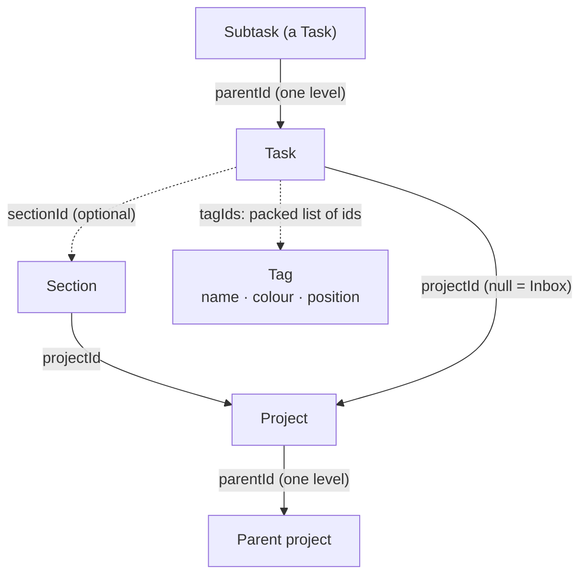

A task lives in exactly one **project** (or the Inbox), may sit under one of that project's
**sections**, may have one level of **subtasks**, and wears any number of **tags**. Lists sort
**importance first, and the due date only breaks ties**. Each of those shapes is small on
purpose, and each has a reason worth knowing before you change it.

## Importance first, due date breaks ties

The product rule the whole app is built on lives in one small function, `sortedFor`, in
[`ui/TaskSorting.kt`](../../ui/src/jvmShared/kotlin/de/andi1984/cadence/ui/TaskSorting.kt).
In the default `SortMode.IMPORTANCE` a list sorts by:

1. open before done,
2. priority — `P1` first, `P4` last (new tasks default to `P3`),
3. due date, undated last,
4. due time, untimed treated as end of day,
5. `sortOrder`, the manual position.

Most todo apps sort by date and let priority colour the rows. Primico sorts by what matters, so an
urgent task without a date is never buried under a pile of dated chores. `SortMode.DATE` and
`SortMode.MANUAL` are the explicit opt-outs the sort chips offer.

Priority is never colour alone: `PrioritySpine` always pairs its bars with the `P1`…`P4` label.

## Projects: a folder, one level deep

A project answers "where does this live". A task has at most one; `projectId = null` is the
Inbox. Projects nest **exactly one level** — *Home / Finance*, never *Home / Finance / Taxes*.

The UI is what enforces that: `CadenceUiState.nestingCandidates` offers no parent for a project
that already has subprojects (and only root projects as parents), and the drag rules in
[`dnd/DragModel.kt`](../../ui/src/jvmShared/kotlin/de/andi1984/cadence/ui/dnd/DragModel.kt)
reject the same moves. The repository keeps a looser backstop — a depth limit and a cycle check
in `upsertProject` — because sync can still land a shape the editor would not have made: two
devices can each nest the other's project offline.

A project's list shows its own tasks and those of its subprojects (`CadenceUiState.tasksIn`).

### Deleting a project never hides tasks

`CadenceRepository.deleteProject` either moves the affected tasks to the Inbox (the default) or
tombstones them, together with the project, its subprojects and their sections, in one
transaction. The one outcome it must never produce is a task whose `projectId` names a project
nobody answers to — that task would silently disappear from every list.
[Undo and deletes](undo-and-deletes.md) has the rest.

## Sections: headings, not containers

A [`Section`](../../core/src/jvmShared/kotlin/de/andi1984/cadence/domain/model/Section.kt) is a
named band inside one project. Sections never nest and never exist without a project. Deleting
one frees its tasks — they stay in the project and lose only the heading — and there is
deliberately no "delete the tasks too": nobody means "and everything under it" by removing a
heading. Moving a task to another project clears its `sectionId`, since the old heading means
nothing there.

## Subtasks: a checklist, one level deep

A subtask is an ordinary `Task` with a `parentId`. Nesting stops at one level: `addSubtask` on a
subtask files the new step next to it, under the same parent, rather than starting a third level.
A checklist stays a checklist instead of turning into a second project tree.

- A parent and its steps **share a project and a section** — moving the parent moves them.
- **Deleting a parent deletes its steps.** A step without its task has no meaning.
- **Finishing a parent finishes its open steps.**
- **A recurring parent hands its checklist to the next occurrence**, unticked
  ([Recurrence](recurrence.md#what-the-next-occurrence-inherits)).

### Which lists show subtasks

The split is deliberate:

| List | Subtasks | Why |
|---|---|---|
| Inbox, a project | Hidden; the parent speaks for them. A row can expand to show its steps. | These lists are *containers*. |
| Today, Upcoming, Search | Shown in their own right, labelled with the parent's title | A dated step is work for that day. |
| A tag's list | Shown, if the step wears the tag | A label on a step belongs to the step. |

The container views read `CadenceUiState.rootTasks()`; the date-driven ones read `state.tasks`.
Every such view is a method on `CadenceUiState` or a `TaskView` in
[`TaskLists.kt`](../../ui/src/jvmShared/kotlin/de/andi1984/cadence/ui/TaskLists.kt) — never a
filter written inside a screen.

## Tags: identity on one side, membership on the other

A project files a task; a tag *describes* it — *waiting on someone*, *five minutes*, *at a
computer* — across any number of projects. Tags are written `@errand` in quick add and have a flat
list of their own.

The decision that shapes all the tag code is invisible from the UI
([ADR 0004](../adr/0004-tags.md#1-a-tag-is-identity-only-membership-is-a-column-on-the-task)):

- **`tagRow` holds identity only**: a name, a colour, a position.
- **Which tasks wear a tag is a column on the task**: `taskRow.tagIds`, the ids packed
  comma-separated by
  [`TagIdsCodec`](../../core/src/jvmShared/kotlin/de/andi1984/cadence/data/db/TagIdsCodec.kt).
  There is no join table.

### Why no join table?

A join row would be a synced record, and every synced record is a tombstone for 90 days. Labels
are applied and removed far more often than tasks are created, so the busiest table in the
system would hold the least information — and it would need its own cursor, push list, merge,
trigger and sweep. Deleting a tag worn by two thousand tasks would push two thousand rows. With
the packed column it is **one** row.

**The cost, stated plainly:** two devices adding *different* tags to the *same* task while offline
resolve last-writer-wins over the whole set, and one addition is lost. A join table would merge
them. It is the same loss the app already accepts for a concurrently edited title, and one
feature is not the place for a second merge model.

### What follows from it

- **Deleting a tag writes one row.** The ids stay on every task that named it;
  `CadenceUiState.tagsOf` drops an id no live tag answers to. Reviving the tag — from a backup or
  the other device — puts it back on exactly the tasks that had it.
- **Writes keep unknown ids.** A pull can deliver a task before the tag it names, so
  `setTaskTags` does not prune.
- **Names are unique case-insensitively, as a validation only.** `@home` has to mean one tag on
  this device, but sync can still land two, and both are shown. Reconciling them would rewrite
  every task naming the loser — the very write the design avoids.
- **A label on a parent does not reach its steps**, unlike a project or a section. A recurring
  task *does* hand its labels to its next occurrence.
- **A tag is dropped onto, never into.** Dropping a task on a tag adds the label and keeps the
  others (`CadenceViewModel.applyTag`, add-only, because the dragged row is a stale snapshot).
  Dragging a tag only reorders the list.

The wire and the backup file are not packed: `tasks.tag_ids` is a Postgres `uuid[]`, and
`BackupTask.tagIds` is a JSON array. The packed string is a storage detail.

## Manual order: dense integers from 0

Tasks, projects, sections and tags all carry a `sortOrder`. `SortMode.MANUAL` sorts by it, and
dragging writes it: `reorderTasks`, `reorderProjects`, `reorderSections` and `reorderTags`
renumber the list they are handed **densely from 0**. A new row lands at `max + 1` in its list
rather than sharing 0 with everything else.

### Why not gaps or fractional midpoints?

Sync merges *rows*, not *lists*. Two devices reordering the same list offline interleave under
last-writer-wins whatever the numbering, so clever schemes buy no conflict resistance here — they
would in a CRDT, and this is not one. What they would buy is fewer rows written per drag, and the
store already recovers most of that: the `sortOrder != :sortOrder` guard in `updateSortOrder`
skips rows whose position did not change, so moving one row in a list of ten writes only the rows
that moved — and does not restamp `updatedAt` on the others, which would push the whole list
([ADR 0003, decision 1](../adr/0003-desktop-interaction-model.md#1-manual-order-is-dense-integers-renumbered-from-0)).

## Related

- [Recurrence](recurrence.md)
- [Undo and deletes](undo-and-deletes.md)
- [Data model](../reference/data-model.md)
- [Quick add](../reference/quick-add.md)
- [Glossary](../reference/glossary.md)
- [ADR 0004 — Tags](../adr/0004-tags.md)
