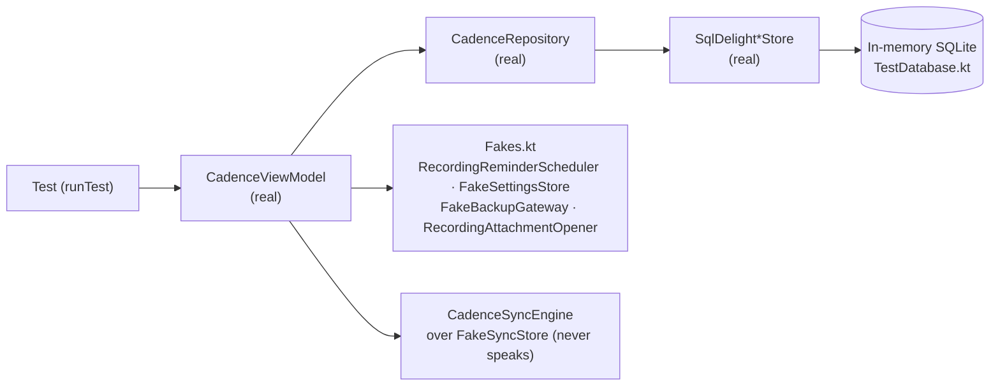

Every test that touches storage runs the **real SQLDelight stores over an in-memory SQLite
database**. The only things faked are the *platform* ports — alarms, file pickers, the settings
file — with small hand-written classes. There is no mocking library and no second test framework:
JUnit 4, `org.junit.Assert`, `kotlin.test` and `kotlinx-coroutines-test`. The whole suite runs in
a few seconds, so running it before you push is the norm, not a chore.

How to run it is in [Run the tests](../how-to/run-tests.md); this page is about why it is shaped
this way.

## Real stores, never fakes of them

The store contract — tombstones hidden from every read, `completeIfOpen`'s idempotence, the
`sortOrder != position` guard, a section delete freeing its tasks — used to be implemented three
times: once in SQL and twice in in-memory fakes. Only the SQL was pinned, and a `:ui` test was
eventually found asserting the *fake's* behaviour where it contradicted the store's. A green test
that proves nothing about production is worse than no test.

So the store ports now have exactly one adapter each. They stay interfaces for their vocabulary —
`Task` and `Project`, not rows — not so that a test can plug something else in. Each module's
`jvmSharedTest` has a `TestDatabase.kt` that opens the schema the way both shells do (create,
then `PRAGMA foreign_keys = ON`) and builds the real stores on `Dispatchers.Unconfined`, so no
work leaves `runTest`'s scheduler.

The same reasoning puts a **real `CadenceRepository`** under every ViewModel test. The rules under
test are the repository's; faking it would only assert that the ViewModel called what the test
told it to expect.

### The one seam between repository and SQLite

`CadenceViewModelUndoTest` needs to catch a delete *in flight* — committed by the slot, not yet
landed — to reproduce [#114](https://github.com/viberfasend/primico/issues/114). Its
`GatedStoreTransaction` is a delegating `StoreTransaction` with a hook before `run`. It wraps the
real one; it does not replace it.

## Fakes for platform ports only

[`Fakes.kt`](../../ui/src/jvmSharedTest/kotlin/de/andi1984/cadence/ui/Fakes.kt) holds the
hand-written doubles: `RecordingReminderScheduler`, `RecordingAttachmentOpener`,
`FakeBackupGateway`, `FakeSettingsStore` and `FakeSyncStore`. These ports genuinely have one
adapter per shell, backed by things a unit-test JVM does not have — `AlarmManager`, the Storage
Access Framework, a system tray — so a fake is the honest seam.

**Why no mocking library?** A recording fake is a dozen lines, reads like the port it implements,
and fails at compile time when the port changes. A mock framework adds a DSL, reflection and
runtime surprises to buy the ability to fake the one layer this suite has decided never to fake.

## The `backgroundScope` rule

:::danger[A class handed its own `CoroutineScope` in a test gets `runTest`'s `backgroundScope`]
This is the one rule here that has cost real time.
:::

`runTest` drains the shared `TestScheduler` after the test body returns. A loop like
`while (true) { … delay(n) }` running on that scheduler — `DesktopReminderScheduler`'s 30-second
poll, the sync engine's foreground poll, the ViewModel's collectors — always has one more `delay`
queued, so the drain never reaches idle. **Nothing fails.** The test JVM spins at 100% CPU forever,
and on a CI runner the job burns its time limit and reports nothing.

A scope of your own plus `@After { scope.cancel() }` does not help: `@After` runs *after* the
drain. `backgroundScope` already runs on the test's scheduler and is cancelled *before* the drain,
so it is both the shorter code and the only correct one. `CadenceViewModelUndoTest`,
`CadenceViewModelCrudTest` and `DesktopReminderSchedulerTest` all take their scope from it.

Two related habits in the ViewModel tests:

- The ViewModel's time is virtual: a `StandardTestDispatcher` sharing `runTest`'s scheduler, so
  the five-second undo window and the two-second sync debounce cost no wall-clock time.
- The test **subscribes to `state`**, because `stateIn(WhileSubscribed)` keeps the upstream cold
  until something reads it.

## Two compilations of one source set

`:core` and `:ui` each have one test source set, `jvmSharedTest`, compiled twice:

| Task | Compiles against | Why CI runs it |
|---|---|---|
| `testDebugUnitTest` | the Android target | what the phone app is built on |
| `jvmTest` | the JVM target | what the desktop app is built on |

Either alone runs every test today, but only `jvmTest` exercises the desktop's compilation, so CI
names both. `:app-desktop` is a plain JVM module with its own `:app-desktop:test`, covering the
classes there with no Compose in them: `DesktopSettingsStore`, `DesktopWorkspaceStore`,
`DesktopReminderScheduler` and `DesktopNavigator`. `:app-android` has no unit tests left since
storage moved to `:core`.

A few tests live in `jvmTest` rather than `jvmSharedTest` — the two ViewModel tests among them, a
placement an old sync client's Android-runtime requirement forced and nothing forces any more.
[Build and CI](../reference/build-and-ci.md) has the exact CI invocation.

## What is deliberately not tested

**No screen is tested.** Composables would need the Compose test runtime, and none of the rules
worth pinning live in one — that is the point of keeping derivations on `CadenceUiState`, drag
rules in `DragModel`, palette ranking in `CommandPaletteModel` and reminder decisions in
`ReminderReconciler`: all plain Kotlin, all tested on the JVM. The flip side is that
`:ui:compileKotlinJvm` runs in CI on its own, because `assembleDebug` only compiles `:ui`'s
Android target, and the screens the desktop is made of could otherwise stop compiling unnoticed.

**One instrumented test.** `QuickAddPatternsDeviceTest` in `app-android/src/androidTest` compiles
the quick-add grammar with the device's **ICU** regex engine. The JVM tests use
`java.util.regex`, and the two disagree — ICU rejects the `(?u)` inline flag outright, a crash no
JVM test can see. It needs a device and CI has no emulator, so run it by hand after touching
`QuickAddPatterns` or a lexicon ([Localise](../how-to/localise.md)).

**The server half has its own harness.** Nothing in Gradle reaches `neon/migrations/`, so
`neon/tests/run.sh` applies them to a throwaway Postgres in Docker and checks the trigger, the
row-level security and the sweep.

## Related

- [Run the tests](../how-to/run-tests.md)
- [Build and CI](../reference/build-and-ci.md)
- [Architecture at a glance](architecture.md#ports-and-adapters)
- [Undo and deletes](undo-and-deletes.md)
- [First contribution](../tutorials/first-contribution.md)
