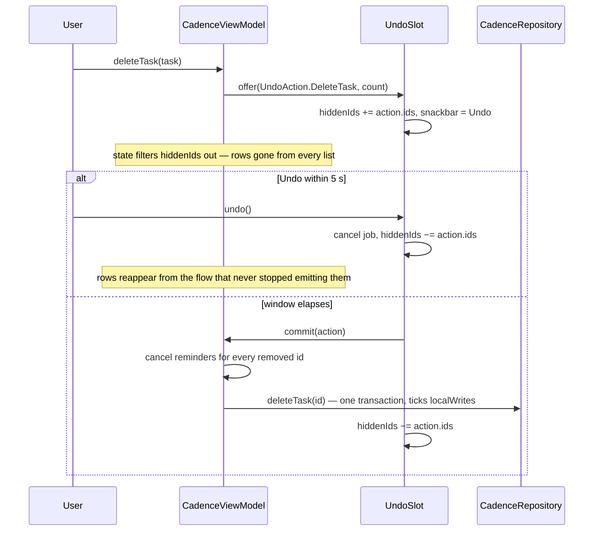

A delete in Primico is **deferred, not reversed**. The rows vanish from every list at once, a
snackbar offers **Undo**, and nothing is written for five seconds. Undo just cancels the pending
job — it costs no transaction at all. When the window elapses, the delete is written as a
**tombstone**, in one transaction, and the reminders of everything it removed are cancelled.

## The deferred write

The machine is [`UndoSlot`](../../ui/src/jvmShared/kotlin/de/andi1984/cadence/ui/undo/UndoSlot.kt),
and it deliberately knows nothing about the repository. `CadenceViewModel` hands it a `commit`
lambda (`commitPendingDelete`) and, at each delete call site, a fresh `UndoAction` describing what
the commit will remove. The *what* is the ViewModel's; the *when* is entirely the slot's.

The actions are `DeleteTask`, `DeleteCompletedInboxTasks`, `DeleteProject` and
`DeleteEverything`. Each carries the set of ids its commit will tombstone.

### Hidden at the source

The slot's `hiddenIds` becomes `CadenceUiState.pendingDeleteIds`, and the ViewModel filters those
ids out of `tasks` and `projects` while building the state — so every list, and every direct read
of `state.tasks`, drops them at once. Sections follow their project and attachments follow their
task, so a heading or a paperclip never outlives its row on screen for the length of the window.

**Why not delete and re-insert on undo?** Re-inserting would be a second write with a fresh
`updatedAt`, and in between, a sync round could already have pushed the delete to the other
device. Deferring means an undone delete never existed anywhere.

## Two rules the slot keeps

There is one pending action at a time, but there can be more than one set of hidden ids — which
is where [#114](https://github.com/viberfasend/primico/issues/114) came from. Both rules are
pinned in `UndoSlotTest` against a recording `commit` lambda, with no repository involved.

**1. `undo()` subtracts its own action's ids, never the whole set.** A second delete settles the
first one out of band — the user moved on — and that commit may still be in flight with its ids
in `hiddenIds`. Clearing the whole set flashed those rows back into every list until the write
landed and took them away again. Nothing rescues a settled delete; that is what settling it
means.

**2. An informational message never displaces a live undo — it queues.** A validation message is
repeatable feedback about a form still on screen; the undo is a five-second, one-time chance to
take a delete back. Overwriting the snackbar took that chance away silently, while the delete
committed anyway. `UndoSlot.show` holds the message in `queuedMessage` until the undo resolves.

Dismissing the snackbar does not rush the commit either; it only stops showing it.

## The commit: one transaction per delete

Every delete is a tombstone ([Local-first](local-first.md#deleting-is-a-tombstone)), and each
repository method that performs one runs its storage writes through a single
`storeTransaction.run { … }`:

- **`deleteTask`** gathers the task and its subtasks, deletes their attachment rows, and
  tombstones them together. A process killed between the steps used to leave a task alive with
  its attachments gone, or the reverse.
- **`deleteProject`** reads which tasks are affected, deletes their attachments if the tasks go
  too, and runs `tombstoneProjectWithChildren` — the project, its subprojects and their sections
  are tombstoned, and the tasks either move to the Inbox (`projectId = NULL`, the default) or are
  tombstoned with them. **Deleting a project never silently hides tasks**: a task left naming a
  project nobody answers to would vanish from every list.
- **`deleteCompletedInboxTasks`** rechecks each candidate inside the transaction, so a task that
  was moved or reopened during the undo window survives.

Reclaiming blobs no row names any more happens *after* the transaction: it is a filesystem
clean-up, idempotent on its own, and nothing a SQL rollback could undo
([Attachments](attachments.md)).

### Cancelling reminders

`ReminderScheduler.sync` only ever sees tasks that still exist, so it cannot cancel an alarm for
one that is already gone. Every delete therefore reports what it removed —
`deleteProject` and `deleteEverything` return the ids of the tasks they tombstoned — and
`commitPendingDelete` calls `reminderScheduler.cancel` for each. The ViewModel asks the
repository for the set rather than trusting the list it drew: `deleteProject` captures
`allTasksIn`, which includes subtasks and superseded occurrences that the screen never showed.

## The danger zone

Settings → Danger zone → **Delete all data** is the only wipe in the app, and it is still a
tombstone. `CadenceRepository.deleteEverything()` stamps `deletedAt` on every task, section, tag
and project rather than dropping rows. A `DELETE` would leave the other device holding rows it
has never seen deleted, and the next pull would hand the whole list back.

Three gates, on purpose:

1. the button,
2. a dialog naming the counts,
3. the ordinary undo window — `wipeEverything` goes through `UndoSlot` like any other delete.

The commit wipes whatever is stored *when it runs*, not the ids captured when the dialog was
confirmed: a row merged in by a pull during those five seconds goes too, and its alarm is
cancelled with the rest.

The wipe is not one transaction. Tasks are tombstoned first, then sections, tags and projects, as
separate statements — so a process killed part-way leaves empty projects, never tasks filed under
projects that no longer answer. Every statement is idempotent (`WHERE deletedAt IS NULL`), so
running the wipe again finishes the job.

## Related

- [Local-first](local-first.md)
- [Tasks, projects and tags](tasks-projects-tags.md)
- [Reminders](reminders.md)
- [Testing philosophy](testing-philosophy.md) — how `CadenceViewModelUndoTest` reaches the in-flight state
