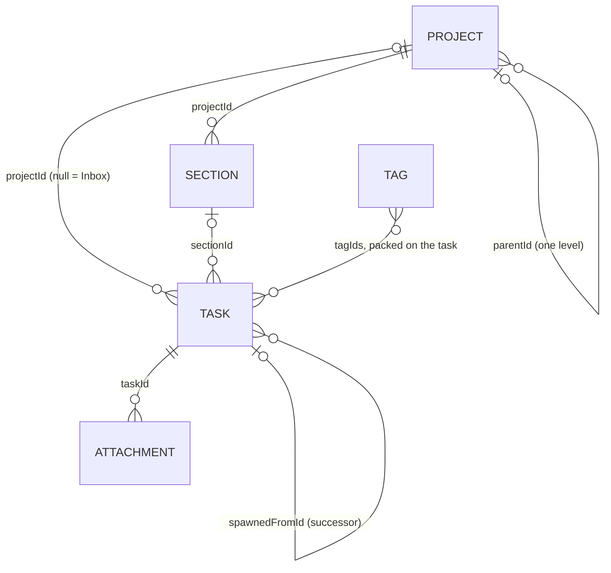

The domain model is plain Kotlin data classes in
[`core/…/domain/model/`](../../core/src/jvmShared/kotlin/de/andi1984/cadence/domain/model/), with
no database or Android imports. How these types become columns is in [Database](database.md),
how they become JSON in [Backup format](backup-format.md) and [Sync wire format](sync-wire.md).
The ideas behind them are in [Tasks, projects and tags](../concepts/tasks-projects-tags.md) and
[Recurrence](../concepts/recurrence.md).

## Relationships

Every link is an id string, and none is enforced by the database except
`attachmentRow.taskId` (see [Database](database.md#gotchas-checklist)). A link that names nothing
is tolerated and repaired on read: a task whose project is gone lands in the Inbox, a tag id no
live tag answers to is dropped by `CadenceUiState.tagsOf`.

## Common conventions

| Convention | Applies to | Rule |
|---|---|---|
| `id` | `Task`, `Project`, `Section`, `Tag`, `Attachment` | A UUIDv7 string. Defaults to `""`; `CadenceRepository` mints one (`UuidV7.random()`) when a new row is saved with a blank id. Storage never assigns ids. |
| Successor id | `Task` | Derived, not random: `UuidV7.successorId(spawnedFromId, occurrenceDate)`, so two devices completing the same occurrence offline produce the same id. |
| `updatedAt` | all synced types | Last write, local or merged in; conflicts resolve on it (greater wins, ties keep what is stored). Stamped by `CadenceRepository.now()`, truncated to milliseconds. Default `Instant.EPOCH`. |
| `deletedAt` | all synced types | Tombstone. Non-null means deleted; every ordinary read hides it. Default `null`. |
| `sortOrder` | all list types | Manual position, dense from `0` within its bucket. A new row lands at `max + 1`. |

## Task

[`Task.kt`](../../core/src/jvmShared/kotlin/de/andi1984/cadence/domain/model/Task.kt)

| Field | Type | Default | Meaning |
|---|---|---|---|
| `id` | `String` | `""` | UUIDv7, minted on first save. |
| `title` | `String` | — (required) | The task's text. |
| `notes` | `String?` | `null` | Free text. |
| `priority` | `Priority` | `Priority.DEFAULT` (`P3`) | Importance; sorts before the due date. |
| `projectId` | `String?` | `null` | Project the task is filed under; `null` is the Inbox. |
| `sectionId` | `String?` | `null` | Section of `projectId` the task is grouped under; `null` is the ungrouped band. Cleared when the task moves to another project. |
| `tagIds` | `List<String>` | `emptyList()` | Tag ids in the order applied. Membership lives here; there is no join table. |
| `parentId` | `String?` | `null` | The task this one is a step of. One level deep. |
| `spawnedFromId` | `String?` | `null` | The finished occurrence whose completion inserted this row. |
| `dueDate` | `LocalDate?` | `null` | Due day. |
| `dueTime` | `LocalTime?` | `null` | Due time of day. Reminder leads count back from it. |
| `reminderTime` | `LocalTime?` | `null` | An exact reminder time on the due day, independent of `dueTime`. |
| `completedAt` | `Instant?` | `null` | When it was completed; `null` while open. |
| `createdAt` | `Instant` | `Instant.EPOCH` | Creation time. |
| `sortOrder` | `Int` | `0` | Manual position within its project (or the Inbox). Subtasks are ordered within their parent. |
| `recurrence` | `RecurrenceRule?` | `null` | The repeat rule, or `null`. |
| `updatedAt` | `Instant` | `Instant.EPOCH` | See conventions. |
| `deletedAt` | `Instant?` | `null` | See conventions. |

Derived members: `isDone` (`completedAt != null`), `isInbox` (`projectId == null`), `isSubtask`
(`parentId != null`), `isOverdue(today)` (open, dated, before today), `isDueOn(day)`.

Helpers in the same file: `List<Task>.withoutSupersededOccurrences()` drops a completed
occurrence that some other row names as its `spawnedFromId`; `SubtaskProgress(done, total)` with
`fraction` and `isComplete`.

## Project

[`Project.kt`](../../core/src/jvmShared/kotlin/de/andi1984/cadence/domain/model/Project.kt)

| Field | Type | Default | Meaning |
|---|---|---|---|
| `id` | `String` | `""` | UUIDv7. |
| `name` | `String` | — (required) | Display name; must not be blank (`upsertProject` refuses it). |
| `colorHex` | `String` | `"#006A60"` | Colour as `#RRGGBB`. |
| `parentId` | `String?` | `null` | Parent project. |
| `sortOrder` | `Int` | `0` | Position among the projects with the same `parentId`. |
| `updatedAt` | `Instant` | `Instant.EPOCH` | See conventions. |
| `deletedAt` | `Instant?` | `null` | See conventions. |

Derived: `isSubproject` (`parentId != null`). Helpers: `ProjectTreeNode(project, children)`,
`List<Project>.toTree()` (one level, orphans dropped), `projectPath(project, all)` (`"Home / Finance"`).

:::note
The UI nests projects exactly one level (`CadenceUiState.nestingCandidates`, the drag model's
`nestOrReject`, the "Nest under" menu). `CadenceRepository.upsertProject` itself only refuses a
cycle and a depth of `MAX_PROJECT_NESTING_DEPTH` (`5`) or more.
:::

## Section

[`Section.kt`](../../core/src/jvmShared/kotlin/de/andi1984/cadence/domain/model/Section.kt) — a
heading inside one project's list. Never nested, never project-less.

| Field | Type | Default | Meaning |
|---|---|---|---|
| `id` | `String` | `""` | UUIDv7. |
| `projectId` | `String` | — (required) | The project this section groups. |
| `name` | `String` | — (required) | Heading text. |
| `sortOrder` | `Int` | `0` | Position among the project's sections. |
| `updatedAt` | `Instant` | `Instant.EPOCH` | See conventions. |
| `deletedAt` | `Instant?` | `null` | See conventions. |

## Tag

[`Tag.kt`](../../core/src/jvmShared/kotlin/de/andi1984/cadence/domain/model/Tag.kt) — identity
only; which tasks wear it is `Task.tagIds`.

| Field | Type | Default | Meaning |
|---|---|---|---|
| `id` | `String` | `""` | UUIDv7. |
| `name` | `String` | — (required) | Display name. Unique case-insensitively on one device (a validation, not a constraint). |
| `colorHex` | `String` | `"#3E6373"` | Colour as `#RRGGBB`. |
| `sortOrder` | `Int` | `0` | Position in the one flat tag list. |
| `updatedAt` | `Instant` | `Instant.EPOCH` | See conventions. |
| `deletedAt` | `Instant?` | `null` | See conventions. |

Derived: `handle` — `name` with spaces removed (`"Deep Work"` → `DeepWork`), what `@…` matches.
`List<Tag>.matchingHandle(typed)` tries, case-insensitively: exact name, then exact handle, then a
handle prefix — the prefix pass answers only when exactly one tag matches.

## Attachment

[`Attachment.kt`](../../core/src/jvmShared/kotlin/de/andi1984/cadence/domain/model/Attachment.kt)
— local to the device: never synced, not in the backup file. See
[Attachments](../concepts/attachments.md).

| Field | Type | Default | Meaning |
|---|---|---|---|
| `id` | `String` | `""` | UUIDv7. |
| `taskId` | `String` | — (required) | The task it is filed on. |
| `kind` | `AttachmentKind` | — (required) | `LINK` or `FILE`. |
| `name` | `String` | — (required) | File name, or the link's title. |
| `mimeType` | `String` | — (required) | The blob's media type; `"text/uri-list"` for a `LINK`. |
| `sha256` | `String?` | `null` | Lowercase hex SHA-256 of the bytes — the blob's name. `null` for a `LINK`. |
| `sizeBytes` | `Long` | `0L` | Size of the blob. |
| `url` | `String?` | `null` | The URL for a `LINK`; `null` for a `FILE`. |
| `createdAt` | `Instant` | `Instant.EPOCH` | When it was added. |
| `sortOrder` | `Int` | `0` | Position on the task. |

Derived: `isImage` (`mimeType.startsWith("image/")`). Limits, in
[`CadenceRepository.kt`](../../core/src/jvmShared/kotlin/de/andi1984/cadence/data/CadenceRepository.kt):
`MAX_ATTACHMENT_BYTES` = 25 MiB, `MAX_ATTACHMENTS_PER_TASK` = 20. (`MAX_SUBTASKS_PER_PARENT` = 100
lives beside them.)

## RecurrenceRule

[`Recurrence.kt`](../../core/src/jvmShared/kotlin/de/andi1984/cadence/domain/model/Recurrence.kt).
Dates are computed by [`RecurrenceEngine`](../../core/src/jvmShared/kotlin/de/andi1984/cadence/domain/recurrence/RecurrenceEngine.kt).

| Field | Type | Default | Meaning |
|---|---|---|---|
| `mode` | `RecurrenceMode` | `SCHEDULE` | Calendar rule, or anchored to the completion day. |
| `interval` | `Int` | `1` | Every *n* units. Read as at least 1 everywhere. |
| `unit` | `RecurrenceUnit` | `WEEK` | Day, week, month or year. |
| `daysOfWeek` | `Set<DayOfWeek>` | `emptySet()` | Weekly rules: which days. Empty means "same weekday, every *n* weeks". |
| `monthlyMode` | `MonthlyMode` | `DAY_OF_MONTH` | Monthly and yearly rules: how the day is picked. |
| `dayOfMonth` | `Int?` | `null` | For `DAY_OF_MONTH`; `null` reads as 1. Clamped to the month's length. |
| `nthWeek` | `Int?` | `null` | For `NTH_WEEKDAY`: 1–4, and 5 (or more) means "the last one". `null` reads as 1. |
| `nthDayOfWeek` | `DayOfWeek?` | `null` | For `NTH_WEEKDAY`; `null` reads as Monday. |

`RecurrenceRule.fromNames(…)` builds a rule from enum *names* — what the backup file and the wire
carry. It is lenient: an unknown name falls back to the field default, an unknown weekday is
dropped, `interval` is clamped to at least 1.

### RecurrenceMode

| Value | Next date is computed from |
|---|---|
| `SCHEDULE` | The previous due date, walking the calendar. Completing late hands over to the first occurrence not before the completion day. |
| `AFTER_COMPLETION` | The day the task was completed, plus `interval` × `unit`. |

### RecurrenceUnit

`DAY`, `WEEK`, `MONTH`, `YEAR`.

### MonthlyMode

| Value | Day chosen in a month |
|---|---|
| `DAY_OF_MONTH` | `dayOfMonth` (default 1), clamped to the month's last day. |
| `LAST_DAY` | The last day of the month. |
| `LAST_WEEKDAY` | The last Monday–Friday of the month. |
| `NTH_WEEKDAY` | The `nthWeek`-th `nthDayOfWeek`; `nthWeek` ≥ 5 is the last one. |

A yearly rule with `DAY_OF_MONTH` and no `dayOfMonth` simply adds `interval` years.

## Priority

[`Priority.kt`](../../core/src/jvmShared/kotlin/de/andi1984/cadence/domain/model/Priority.kt)

| Value | `level` | `shortLabel` | `filledBars` | English name | German name |
|---|---|---|---|---|---|
| `P1` | 1 | `P1` | 3 | Critical | Kritisch |
| `P2` | 2 | `P2` | 2 | High | Hoch |
| `P3` | 3 | `P3` | 1 | Normal | Normal |
| `P4` | 4 | `P4` | 0 (drawn as a dash) | Low | Niedrig |

`Priority.DEFAULT` is `P3`. `Priority.fromLevel(n)` returns `DEFAULT` for any level outside 1–4.
The names come from string resources via `ui/format/PriorityLabels.kt`.

## CadenceSettings

[`ui/settings/SettingsStore.kt`](../../ui/src/jvmShared/kotlin/de/andi1984/cadence/ui/settings/SettingsStore.kt)
— per device, never synced. Where each shell stores them is in [Configuration](configuration.md#per-device-settings).

| Field | Type | Class default | Meaning |
|---|---|---|---|
| `theme` | `ThemeChoice` | `SYSTEM` | `SYSTEM`, `LIGHT`, `DARK`. |
| `density` | `Density` | `COMFORTABLE` | `COMFORTABLE` (64 dp rows) or `COMPACT` (52 dp rows). |
| `sortMode` | `SortMode` | `IMPORTANCE` | `IMPORTANCE`, `DATE`, `MANUAL`. |
| `showCompleted` | `Boolean` | `true` | Whether completed tasks stay in the lists. |
| `remindersEnabled` | `Boolean` | `true` | Whether this device fires reminders. The shell's store decides the real default: on for Android, off for the desktop. |
| `reminderLeadMinutes` | `List<Int>` | `emptyList()` | One notification per entry, that many minutes before `dueTime`. |

## Sync and desktop state

Two more records are persisted but are not domain data.

**`SyncState`** ([`data/sync/SyncStore.kt`](../../core/src/jvmShared/kotlin/de/andi1984/cadence/data/sync/SyncStore.kt)),
stored in `syncStateRow`:

| Field | Type | Default | Meaning |
|---|---|---|---|
| `session` | `String?` | `null` | Serialised `NeonSession` (`accessToken`, `sessionCookie`, `email`); `null` when signed out. |
| `taskCursor`, `projectCursor`, `sectionCursor`, `tagCursor` | `String?` | `null` | Per-table pull cursor: the newest `server_updated_at` pulled, as ISO-8601 text (the server's clock). |
| `pushWatermark` | `Instant` | `Instant.EPOCH` | The newest local `updatedAt` pushed (this device's clock). |
| `lastSyncedAt` | `Instant?` | `null` | When the last round finished. |
| `lastSweepAt` | `Instant?` | `null` | When tombstones were last collected. |

**`DesktopWorkspace`** ([`DesktopWorkspaceStore.kt`](../../app-desktop/src/main/kotlin/de/andi1984/cadence/desktop/data/DesktopWorkspaceStore.kt)),
desktop only, in `workspace.json`:

| Field | Type | Default | Clamp |
|---|---|---|---|
| `sidebarWidth` | `Float` (dp) | `268f` | 200–420 |
| `sidebarCollapsed` | `Boolean` | `false` | — |
| `collapsedProjects` | `Set<String>` | `emptySet()` | — |
| `windowWidth` | `Float` (dp) | `1180f` | at least 640 |
| `windowHeight` | `Float` (dp) | `820f` | at least 480 |
| `windowX`, `windowY` | `Float?` | `null` (the platform places the window) | a negative coordinate is dropped back to `null` |
| `maximized` | `Boolean` | `false` | — |

## Related

- [Database](database.md) — the columns these become
- [Glossary](glossary.md)
- [ADR 0004](../adr/0004-tags.md) — why tag membership is a column on the task
