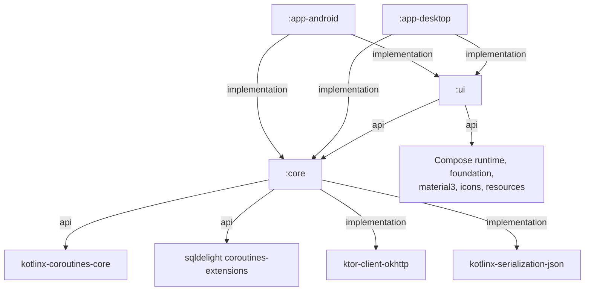

The build is four Gradle modules, declared in [`settings.gradle.kts`](../../settings.gradle.kts)
under the root project name `Primico`. Every Kotlin package starts with `de.andi1984.cadence` —
the code keeps the old name on purpose, see [Naming](../concepts/naming.md). Why the modules are
split this way is in [Architecture](../concepts/architecture.md).

## The four modules

| Module | Gradle plugin | Targets | Android namespace | Build file |
|---|---|---|---|---|
| `:core` | Kotlin Multiplatform + Android library + SQLDelight + serialization | `androidTarget`, `jvm` | `de.andi1984.cadence.core` | [`core/build.gradle.kts`](../../core/build.gradle.kts) |
| `:ui` | Kotlin Multiplatform + Android library + Compose Multiplatform | `androidTarget`, `jvm` | `de.andi1984.cadence.ui` | [`ui/build.gradle.kts`](../../ui/build.gradle.kts) |
| `:app-android` | Android application + Kotlin Android + Compose + serialization | Android | `de.andi1984.cadence` | [`app-android/build.gradle.kts`](../../app-android/build.gradle.kts) |
| `:app-desktop` | Kotlin JVM + Compose Multiplatform + serialization | JVM (`jvmTarget` 17) | — | [`app-desktop/build.gradle.kts`](../../app-desktop/build.gradle.kts) |

Shared values across the Android-facing modules: `compileSdk = 36`, `minSdk = 26`, Java/Kotlin
bytecode 17. `:app-android` also sets `targetSdk = 36`. Library versions live in one catalog,
[`gradle/libs.versions.toml`](../../gradle/libs.versions.toml).

## Dependency graph

`:ui` depends on `:core` with `api`, because every screen signature speaks `Task`, `Project` and
the repository's types. `:core` exposes coroutines with `api` because the store ports return
`Flow`.

## Source sets

`:core` and `:ui` use the same hand-declared layout. Both targets are JVMs, so shared code lives
in `jvmShared` and may use the JDK (`java.time` in particular); `commonMain` holds no hand-written
code.

| Source set | Depends on | `:core` holds | `:ui` holds |
|---|---|---|---|
| `commonMain` | — | Generated only: SQLDelight's `CadenceDatabase` and `*Queries`, from `src/commonMain/sqldelight/…/*.sq` | Generated only: the `Res` accessors for `src/commonMain/composeResources/` (package `de.andi1984.cadence.ui.resources`) |
| `jvmShared` | `commonMain` | All hand-written code, plus the generated `NeonBuildConfig` (see [Configuration](configuration.md)) | All hand-written code |
| `androidMain` | `jvmShared` | `DatabaseDriverFactory` actual (`AndroidSqliteDriver`, takes a `Context`) | — |
| `jvmMain` | `jvmShared` | `DatabaseDriverFactory` actual (`JdbcSqliteDriver`, takes a data directory `File`) | — |
| `jvmSharedTest` | `commonTest` | Every test; `TestDatabase.kt` (in-memory SQLite) | `CadenceUiState`, sorting, palette, drag model, `UndoSlot` tests; `Fakes.kt`, `TestDatabase.kt` |
| `androidUnitTest` | `jvmSharedTest` | runs `jvmSharedTest` as `testDebugUnitTest` | same |
| `jvmTest` | `jvmSharedTest` | `CadenceCoreTest`, `DatabaseDriverFactoryTest` | `CadenceViewModelCrudTest`, `CadenceViewModelUndoTest` |

`DatabaseDriverFactory` is the one `expect`/`actual` pair; `-Xexpect-actual-classes` is passed to
both `:core` targets because expect/actual classes are still Beta.

`:app-android` uses the plain Android layout (`src/main/java`, `src/androidTest/java`); its only
test is the instrumented `QuickAddPatternsDeviceTest`. `:app-desktop` uses `src/main/kotlin` and
`src/test/kotlin`. How to run each set is in [Run the tests](../how-to/run-tests.md).

## Package map — `:core`

All under [`core/src/jvmShared/kotlin/de/andi1984/cadence/`](../../core/src/jvmShared/kotlin/de/andi1984/cadence/).

| Package | What lives there |
|---|---|
| `data` | `CadenceCore` (the shared dependency graph), `CadenceRepository` (every rule about writing), `Stores.kt` (the store ports, `TransactionScope`, `StoreTransaction`, `BackupStore`, `AttachmentStore`), `BlobStore` (content-addressed attachment bytes) |
| `data.db` | `SqlDelightStores.kt` (every store adapter and every row↔domain conversion), `SqlDelightSyncStore`, `RecurrenceCodec` (packed recurrence column), `TagIdsCodec` (packed tag column), `DatabaseDriverFactory` (`expect`) and `CADENCE_DATABASE_FILE_NAME`. The schema is `src/commonMain/sqldelight/de/andi1984/cadence/data/db/*.sq` and `*.sqm` |
| `data.sync` | `CadenceSyncEngine`, `NeonAuthClient`, `PostgrestHttp`, `SessionTokens`, `NeonSession`, `NeonConfig`, `RemoteRecords.kt` (wire DTOs), `SyncStore` |
| `domain` | `Parsing.kt` — `parseOrNull`, shared by the two decoders of published shapes |
| `domain.backup` | `BackupCodec` (the `cadence.backup` file), `BackupOutcome` / `BackupFailure` |
| `domain.id` | `UuidV7` — `random()`, `randomAt()`, `successorId()` |
| `domain.model` | `Task`, `Project`, `Section`, `Tag`, `Attachment`, `Priority`, `RecurrenceRule` and its enums |
| `domain.parse` | `QuickAddParser`, `QuickAddLexicon`, `QuickAddPatterns` |
| `domain.recurrence` | `RecurrenceEngine`, `RecurrenceSummary` (structured, prose-free summaries) |
| `domain.reminder` | `ReminderPlanner` (when), `ReminderReconciler` (what to arm, cancel or keep) |

## Package map — `:ui`

All under [`ui/src/jvmShared/kotlin/de/andi1984/cadence/ui/`](../../ui/src/jvmShared/kotlin/de/andi1984/cadence/ui/).

| Package | What lives there |
|---|---|
| `ui` | `CadenceViewModel` and `CadenceUiState` (one file), `CadenceViewModelFactory.kt` (`cadenceViewModel(core, adapters, scope)`, `ViewModelAdapters`), `TaskLists.kt` (every list a screen draws), `TaskSorting.kt` (importance first, due date breaks ties) |
| `ui.attachments` | `AttachmentCard`, `AttachmentLinkDialog`, `AttachmentThumbnail` |
| `ui.components` | Shared building blocks: `TaskRow`, `PrioritySpine`, `AppIcons`, `ContextMenu`, `RowMenus`, `RowInteractions`, `RowSelection`, `ScreenHeader`, `SyncControls`, `TagChips`, `UndoSnackbar`, `Pickers`, `Common` |
| `ui.detail` | `TaskDetailScreen` |
| `ui.dnd` | `DragModel.kt` (what a drop means, pure) and `DragAndDrop.kt` (gesture, ghost, highlight) |
| `ui.format` | Every formatter that produces prose: `DateLabels`, `PriorityLabels`, `RecurrenceLabels`, `SyncLabels`, `BackupLabels`, `DiagnosticLabels` |
| `ui.inbox` | `InboxScreen`, `TriageScreen` |
| `ui.palette` | `CommandPaletteModel.kt` — the palette's scoring, pure |
| `ui.platform` | `Ports.kt` — `ReminderScheduler`, `BackupGateway`, `BackupFilePicker`, `AttachmentFilePicker`, `AttachmentOpener`, `BackupTarget`, `AppInfo`, `PickedFile` |
| `ui.projects` | `ProjectsScreen`, `ProjectDetailScreen`, `ProjectDialogs` |
| `ui.quickadd` | `QuickAddSheet` |
| `ui.recurrence` | `RecurrenceSheet` |
| `ui.resources` | Generated `Res` accessors (not a directory in `src/`) |
| `ui.search` | `SearchScreen` |
| `ui.settings` | `SettingsScreen`, `SettingsStore.kt` (the port and `CadenceSettings`), `SyncUiState` |
| `ui.tags` | `TagsScreen`, `TagDetailScreen`, `TagDialogs` |
| `ui.theme` | `Theme`, `Color`, `Type` — `CadenceTheme`, `LocalCadenceColors`, `LocalCadenceDensity` |
| `ui.today` | `TodayScreen` |
| `ui.undo` | `UndoSlot` — the deferred-delete snackbar slot |
| `ui.upcoming` | `UpcomingScreen` |

Strings: [`ui/src/commonMain/composeResources/values/strings.xml`](../../ui/src/commonMain/composeResources/values/strings.xml)
and `values-de/strings.xml`. See [Localise the app](../how-to/localise.md).

## Package map — the shells

| Module | Package | What lives there |
|---|---|---|
| `:app-android` | `de.andi1984.cadence` | `AppContainer.kt` (`AppContainer`, `CadenceApplication`), `MainActivity` |
| | `.assistant` | `AppActionsIntents` — the App Actions voice-capture entry point |
| | `.data.attachments` | `AndroidAttachmentOpener` |
| | `.data.backup` | `BackupIo` (SAF export and import) |
| | `.data.settings` | `SharedPrefsSettingsStore` |
| | `.reminders` | `AlarmReminderScheduler`, `ReminderReceiver`, `BootReceiver`, `ReminderRequestCodes` |
| | `.sync` | `SyncWorker` (WorkManager) |
| | `.ui` | `CadenceApp` (NavHost, bottom bar), `CadenceViewModelHost` |
| | `.ui.attachments`, `.ui.backup` | SAF file pickers |
| | `.widget` | Glance home-screen widgets — rules in [`app-android/CLAUDE.md`](../../app-android/CLAUDE.md) |
| `:app-desktop` | `de.andi1984.cadence.desktop` | `Main.kt` (`main()`, window, key dispatch), `AppContainer` |
| | `.desktop.data` | `DesktopSettingsStore`, `DesktopWorkspaceStore`, `DesktopReminderScheduler`, `DesktopBackupIo`, `DesktopBackupFilePicker`, `DesktopAttachments.kt` |
| | `.desktop.platform` | `PlatformDirs` |
| | `.desktop.ui` | `CadenceDesktopApp`, `Navigation.kt` (`Route`, `DesktopNavigator`), `Sidebar`, `CommandPaletteDialog`, `Shortcuts.kt`, `ShortcutSheet`, `TrayMenu` |

## Related

- [Architecture](../concepts/architecture.md) — why the split is what it is
- [Desktop shell](../concepts/desktop-shell.md)
- [ADR 0001](../adr/0001-desktop-app-and-multi-device-sync.md) — the phases that produced this layout
