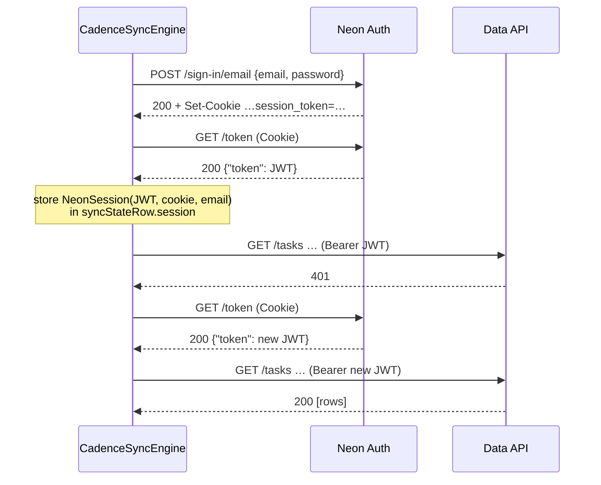

Sync is hub-and-spoke: every signed-in device talks to one Neon project, never to another device.
The server half is two services — the **Data API** (PostgREST over the project's Postgres) for
rows, and **Neon Auth** (Better Auth) for the session — both reached with hand-rolled Ktor calls
from [`core/…/data/sync/`](../../core/src/jvmShared/kotlin/de/andi1984/cadence/data/sync/). Why it
works this way is in [Sync](../concepts/sync.md); how to point a build at your own project is
[Self-hosting](../self-hosting.md); how to look inside a failing round is
[Debug sync](../how-to/debug-sync.md).

## Endpoints

| Setting | Source | Shape |
|---|---|---|
| Data API base URL | `CADENCE_NEON_DATA_API_URL` at build time | `https://<endpoint>.apirest.<region>.aws.neon.tech/neondb/rest/v1` |
| Neon Auth base URL | `CADENCE_NEON_AUTH_URL` at build time | `https://<endpoint>.neonauth.<region>.aws.neon.tech/neondb/auth` |

Both are compiled into `NeonConfig.fromBuild`; either one missing makes it `null` and sync inert
(see [Configuration](configuration.md#build-time-environment)). There is no API key: the account
is the credential and row-level security protects the rows.

## Server schema

[`neon/migrations/0001_cadence_sync.sql`](../../neon/migrations/0001_cadence_sync.sql) creates four
tables in `public`. Every table starts with `user_id` and ends with the three bookkeeping columns,
and has no foreign key to any other.

### Columns shared by every table

| Column | Type | Default | Meaning |
|---|---|---|---|
| `user_id` | `uuid not null` | `(auth.user_id())::uuid` | The owner, taken from the JWT's `sub`. The client never sends it. |
| `id` | `uuid not null` | — | The record's UUIDv7. |
| `updated_at` | `timestamptz not null` | — | The **device's** clock; what conflicts resolve on. |
| `deleted_at` | `timestamptz` | `null` | Tombstone. |
| `server_updated_at` | `timestamptz not null` | `now()` | The **server's** clock, set only by the trigger. What pull cursors read. |

Primary key on every table: `(user_id, id)`.

### tasks

| Column | Type | Notes |
|---|---|---|
| `title` | `text not null` | |
| `notes` | `text` | |
| `priority` | `smallint not null` | 1–4 |
| `project_id` | `uuid` | |
| `parent_id` | `uuid` | |
| `spawned_from_id` | `uuid` | |
| `section_id` | `uuid` | |
| `due_date` | `date` | |
| `due_time` | `time` | |
| `reminder_time` | `time` | |
| `completed_at` | `timestamptz` | |
| `created_at` | `timestamptz not null` | |
| `sort_order` | `integer not null` | no default — the client always sends it |
| `recurrence` | `jsonb` | the [recurrence object](#remoterecurrence) |
| `tag_ids` | `uuid[] not null default '{}'` | no join table |

### projects, sections, tags

| Table | Columns besides the shared ones |
|---|---|
| `projects` | `name text not null`, `color_hex text not null`, `parent_id uuid`, `sort_order integer not null` |
| `sections` | `project_id uuid not null`, `name text not null`, `sort_order integer not null` |
| `tags` | `name text not null`, `color_hex text not null`, `sort_order integer not null` |

### Indexes

| Index | On | Serves |
|---|---|---|
| `{table}_by_server_updated_at` | `(user_id, server_updated_at)` | the pull |
| `tasks_by_tag_ids` | `gin (tag_ids)` | array containment (`tag_ids @> …`), for a future web client |
| `{table}_tombstones` | `(server_updated_at) where deleted_at is not null` | the tombstone sweep |

### Stale-write trigger

`{table}_reject_stale` — `before insert or update … for each row`, calling
`reject_stale_task()` / `reject_stale_project()` / `reject_stale_section()` / `reject_stale_tag()`.

| Incoming `updated_at` vs stored | Trigger returns | Effect |
|---|---|---|
| no stored row | the row, with `server_updated_at := now()` | inserted |
| strictly greater | the row, with `server_updated_at := now()` | stored |
| equal or smaller | `null` | **that row** is skipped silently; the rest of the batch still lands |

Ties keep the incumbent, the same rule as the client's merge. This is what lets the client push
everything above its watermark with no `dirty` column: a row that came *from* the server and is
pushed straight back ties, and is dropped here.

### Row-level security and grants

| Object | Setting |
|---|---|
| All four tables | `enable row level security` and `force row level security` |
| Policy `{table}_owner` | `for all to authenticated using (user_id = (auth.user_id())::uuid) with check (same)` |
| Grants | `usage` on schema `public` and `select, insert, update, delete` on the four tables to `authenticated`; everything revoked from `anonymous` |
| `public.schema_migrations` | ([`0002_lock_bookkeeping.sql`](../../neon/migrations/0002_lock_bookkeeping.sql)) all grants revoked from `authenticated` and `anonymous`, RLS enabled with no policy, and the owner's default privileges on future tables, sequences and functions revoked from `authenticated` |

The migrations refuse to run until the Data API is enabled on the branch (it provisions
`auth.user_id()` and the `authenticated`/`anonymous` roles). Apply them with
`CADENCE_NEON_DB_URL=… bash neon/migrate.sh`; `bash neon/tests/run.sh` checks them against a
throwaway Postgres.

## Records on the wire

[`RemoteRecords.kt`](../../core/src/jvmShared/kotlin/de/andi1984/cadence/data/sync/RemoteRecords.kt).
Separate DTOs from the backup file's on purpose, so a column rename cannot change an exported file.
JSON is encoded with `encodeDefaults = true` (every key always sent, `null`s explicit — PostgREST
rejects a bulk insert whose objects disagree on keys) and decoded with `ignoreUnknownKeys = true`.
`user_id` is never sent; `server_updated_at` is sent as `null` and overwritten by the trigger.

### RemoteTask

| JSON key | Type | Domain field | Notes |
|---|---|---|---|
| `id` | string | `id` | |
| `title` | string | `title` | |
| `notes` | string \| null | `notes` | blank reads as `null` |
| `priority` | number | `priority` | `Priority.level`; out of range reads as `P3` |
| `project_id` | string \| null | `projectId` | |
| `section_id` | string \| null | `sectionId` | |
| `tag_ids` | array of string | `tagIds` | blanks and duplicates dropped on read |
| `parent_id` | string \| null | `parentId` | |
| `spawned_from_id` | string \| null | `spawnedFromId` | |
| `due_date` | string \| null | `dueDate` | ISO date |
| `due_time` | string \| null | `dueTime` | ISO time |
| `reminder_time` | string \| null | `reminderTime` | ISO time |
| `completed_at` | string \| null | `completedAt` | instant |
| `created_at` | string | `createdAt` | instant; unreadable reads as the epoch |
| `sort_order` | number | `sortOrder` | |
| `recurrence` | object \| null | `recurrence` | see below |
| `updated_at` | string | `updatedAt` | instant; unreadable reads as the epoch |
| `deleted_at` | string \| null | `deletedAt` | instant |
| `server_updated_at` | string \| null | — | read for the cursor, ignored on the way out |

### RemoteProject, RemoteSection, RemoteTag

| DTO | JSON keys |
|---|---|
| `RemoteProject` | `id`, `name`, `color_hex`, `parent_id`, `sort_order`, `updated_at`, `deleted_at`, `server_updated_at` |
| `RemoteSection` | `id`, `project_id`, `name`, `sort_order`, `updated_at`, `deleted_at`, `server_updated_at` |
| `RemoteTag` | `id`, `name`, `color_hex`, `sort_order`, `updated_at`, `deleted_at`, `server_updated_at` |

### RemoteRecurrence

| JSON key | Type | Default |
|---|---|---|
| `mode` | string | `"SCHEDULE"` |
| `interval` | number | `1` |
| `unit` | string | `"WEEK"` |
| `days_of_week` | array of string | `[]` |
| `monthly_mode` | string | `"DAY_OF_MONTH"` |
| `day_of_month` | number \| null | `null` |
| `nth_week` | number \| null | `null` |
| `nth_day_of_week` | string \| null | `null` |

Enum values are the same names as in the [backup file](backup-format.md#recurrence), decoded
through the same lenient `RecurrenceRule.fromNames`.

### Timestamps

Instants are written with `Instant.toString()` (`2026-09-10T07:31:12.004Z`). PostgREST answers
with an offset (`…+00:00`); both spellings are accepted on read. Every instant is **truncated to
milliseconds** in both directions — Postgres keeps microseconds, SQLite keeps milliseconds, and a
row that came back a microsecond newer would ping-pong forever. `CadenceRepository.now()`
truncates at the source too.

## Requests

[`PostgrestHttp`](../../core/src/jvmShared/kotlin/de/andi1984/cadence/data/sync/PostgrestHttp.kt)
and [`NeonAuthClient`](../../core/src/jvmShared/kotlin/de/andi1984/cadence/data/sync/NeonAuthClient.kt).
`{data}` is the Data API URL, `{auth}` the Neon Auth URL, `{table}` one of `tasks`, `projects`,
`sections`, `tags`.

| Purpose | Request | Headers | Body | Success |
|---|---|---|---|---|
| Sign in | `POST {auth}/sign-in/email` | `Content-Type: application/json` | `{"email": …, "password": …}` | 2xx, a `Set-Cookie` whose name ends in `session_token`, body `{"user":{"email":…}}` |
| Mint a JWT | `GET {auth}/token` | `Cookie: <session cookie>` | — | 2xx, `{"token": "<jwt>"}` |
| Sign out | `POST {auth}/sign-out` | `Cookie`, `Content-Type: application/json` | `{}` | 2xx (best-effort) |
| Pull a page | `GET {data}/{table}?select=*&server_updated_at=gte.{cursor}&order=server_updated_at.asc&limit=1000` | `Authorization: Bearer <jwt>` | — | 2xx, JSON array; `server_updated_at` filter omitted when there is no cursor |
| Push a batch | `POST {data}/{table}?on_conflict=user_id,id` | `Authorization`, `Prefer: resolution=merge-duplicates,return=minimal`, `Content-Type: application/json` | JSON array, ≤ 500 records | 2xx |
| Sweep tombstones | `DELETE {data}/{table}?deleted_at=not.is.null&server_updated_at=lt.{cutoff}` | `Authorization`, `Prefer: return=minimal` | — | 2xx |

The session cookie is captured verbatim (`name=value`, attributes stripped) and kept in
`syncStateRow.session` as part of a `NeonSession { accessToken, sessionCookie, email }` — the HTTP
client has no cookie jar. Error bodies are truncated to 500 characters in exceptions.

HTTP client: Ktor with the OkHttp engine, `connectTimeoutMillis = 10_000`,
`requestTimeoutMillis = 30_000`, `socketTimeoutMillis = 30_000` — generous so a Neon compute
waking from scale-to-zero reads as latency, not as offline.

## Sign-in and the access token

[`SessionTokens.withAccessToken`](../../core/src/jvmShared/kotlin/de/andi1984/cadence/data/sync/SessionTokens.kt)
wraps every Data API call:

| Condition | Action |
|---|---|
| JWT `exp` within 30 s of now, or unreadable | re-mint before the call |
| Call answers 401 | re-mint once and retry; a second 401 is `SessionExpiredException` |
| `GET /token` answers 4xx | `SessionExpiredException` — the session itself is dead |
| Network error | propagates as `IOException` — offline, never a sign-out |

Minting holds its own mutex and re-reads the store first, so the four parallel pulls produce one
`GET /token`. Sign-in answers 400 or 401 as `SignInResult.WrongCredentials`. A stored session
that does not decode as a `NeonSession` (for example a pre-Neon one) counts as signed out.

## A round

`CadenceSyncEngine.syncOnce()` holds a mutex, so rounds never interleave. Unconfigured or signed
out it returns `SyncOutcome.SignedOut` before any request.

| Step | What happens | Constants |
|---|---|---|
| 1. Pull | All four tables are fetched **in parallel**, each from its own cursor moved back by the overlap, oldest first. Each page set is merged and the cursors advanced **in one transaction** (`SyncStore.mergeAndAdvance`). A table is asked again only while it returns a full page whose newest `server_updated_at` moved the cursor. | `PAGE_SIZE = 1000`, `PULL_OVERLAP = 5 s` |
| 2. Push | Everything with `updatedAt` above the watermark (everything, tombstones included, when the watermark is the epoch), sent in reference order: projects, sections, tags, tasks. The new watermark is the newest `updatedAt` actually sent. | `BATCH_SIZE = 500` |
| 3. Stamp | `lastSyncedAt = now` (ms). | |
| 4. Sweep | At most once per day after a successful round: one `DELETE` per table on the server for tombstones whose `server_updated_at` is older than the horizon, then locally `DELETE` rows whose `deletedAt` is older than the same cutoff, and `lastSweepAt = now`. A server failure fails the round, so the local copy is never collected first. | `SWEEP_INTERVAL = 1 day`, `TOMBSTONE_HORIZON = 90 days` |

The merge is the one a backup import uses, without the revival exception: greater `updatedAt`
wins, ties keep what is stored, a tombstone is a version like any other. Pulled rows are not
link-repaired; a link that names a record not yet pulled is tolerated until it arrives.

### When rounds run

| Trigger | Where | Interval |
|---|---|---|
| App start | both shells | once |
| Return to the foreground / window focus | Android `ProcessLifecycleOwner`, desktop window focus | each time |
| After a local write | `CadenceViewModel`, debouncing `CadenceRepository.localWrites` | 2 s (`WRITE_DEBOUNCE`) |
| Foreground poll | `CadenceSyncEngine.startForegroundPoll()`; Android between `onStart` and `onStop`, desktop for the whole process | 60 s (`FOREGROUND_POLL_INTERVAL`) |
| App stop / window close / tray Quit | both shells, fire-and-forget `syncInBackground()` | once |
| A write made from a home-screen widget | Android `SyncWorker.enqueue`, one-shot, needs a network | once, exponential backoff from 30 s, 3 attempts |
| Home-screen widget present and signed in | Android `SyncWorker.ensurePeriodic` | 15 min |
| Manual | desktop header button and `Ctrl`/`Cmd`+`R`; Android pull-to-refresh | on demand |

## Status and failures

[`CadenceSyncEngine.kt`](../../core/src/jvmShared/kotlin/de/andi1984/cadence/data/sync/CadenceSyncEngine.kt)

**`SyncStatus`** (a `StateFlow`):

| Value | Carries | Meaning |
|---|---|---|
| `Unconfigured` | — | The build has no endpoints. Permanent for the process. |
| `SignedOut` | — | No session stored. |
| `Idle` | `email`, `lastSyncedAt` | Signed in, not syncing. |
| `Syncing` | `email` | A round is running. |
| `Failed` | `reason: SyncFailure`, `email`, `lastSyncedAt` | The last round failed. |

**`SyncFailure`** — also emitted once per failed round on the `failures` `SharedFlow`:

| Value | Raised by |
|---|---|
| `OFFLINE` | any `IOException` (network down, timeout) |
| `SESSION_EXPIRED` | `SessionExpiredException`, or a Data API 401 |
| `SERVER` | any other Data API status, any Neon Auth error during a round, anything else |

**`SignInResult`**: `Ok`, `WrongCredentials` (400/401), `Offline` (`IOException`),
`Failed(message)` (any other auth error, or an unconfigured build).

**`SyncOutcome`** of `syncOnce()`: `Ok(pulled, pushed)`, `SignedOut`, `Failed(reason)`.

Signing out revokes the session best-effort, then clears the session, every cursor, the watermark,
`lastSyncedAt` and `lastSweepAt`. It deletes no task, project, section or tag.

## Related

- [Sync](../concepts/sync.md) — the protocol and why
- [Database](database.md#syncstaterow) — the local half of this state
- [ADR 0002](../adr/0002-supabase-sync.md) (the protocol) and [ADR 0005](../adr/0005-neon-sync.md) (the transport)
