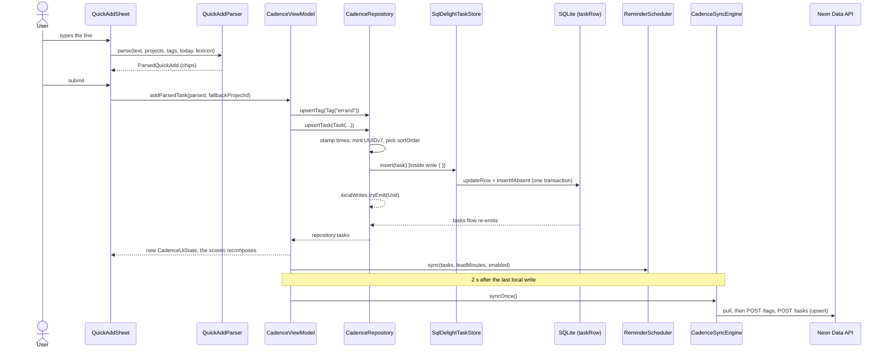

The quickest way to learn a codebase is to follow one piece of data through it. On this page you
type a single line into quick add and follow the task it creates through every layer of Primico
until it reaches the server, stopping at each file along the way.

Here is the line:

```
Buy milk tomorrow 18 Uhr #Home !p2 @errand
```

Two assumptions keep the example honest. The app is running **in German**, since `Uhr` is a German
word and the English lexicon has no word for "o'clock". `tomorrow` still parses, because English is
always folded in. And a project called **Home** already exists: `#Home` only ever *selects* a
project, it never creates one.

:::note
Priority is written `!p2` (or `!2`). A bare `p2` is not a token; it stays in the title. The full
grammar is in the [quick-add reference](../reference/quick-add.md).
:::

## The whole trip at a glance



## 1. The quick-add sheet parses on every keystroke

[`ui/quickadd/QuickAddSheet.kt`](../../ui/src/jvmShared/kotlin/de/andi1984/cadence/ui/quickadd/QuickAddSheet.kt)

The sheet is a stateless composable shared by both shells. It picks a lexicon for the **app's**
language (not the system's), then re-parses whenever the text, the projects or the tags change:

```kotlin
val lexicon = QuickAddLexicon.forLocale(currentLocale())
val parsed = remember(text, projects, tags, lexicon) {
    QuickAddParser.parse(text, projects, tags, today, lexicon)
}
```

Each recognised token comes back with its character range (`spans`). The sheet draws those
ranges as chips and lets a tap on a chip override what was parsed. On submit it hands the result
to the shell's `onSubmit`, and both shells forward it the same way:
`viewModel.addParsedTask(parsed, quickAddProjectId)` in
[`CadenceApp.kt`](../../app-android/src/main/java/de/andi1984/cadence/ui/CadenceApp.kt) on Android
and [`CadenceDesktopApp.kt`](../../app-desktop/src/main/kotlin/de/andi1984/cadence/desktop/ui/CadenceDesktopApp.kt)
on the desktop.

## 2. The parser turns words into fields

[`domain/parse/QuickAddParser.kt`](../../core/src/jvmShared/kotlin/de/andi1984/cadence/domain/parse/QuickAddParser.kt)

`QuickAddParser` is plain Kotlin in `:core`, with no Android and no Compose, so its tests run on the
JVM. It claims tokens in a fixed order (priority, project, tags, recurrence, date, time), and
whatever nobody claimed becomes the title. For our line, the result is:

| Field | Value | Where it came from |
|---|---|---|
| `title` | `Buy milk` | the unclaimed words |
| `priority` | `Priority.P2` | `!p2` |
| `projectId` | the id of **Home** | `#Home`, matched against existing names |
| `tagIds` / `newTagNames` | `[]` / `["errand"]` | `@errand` matched no tag, so it is reported as one to create |
| `dueDate` | tomorrow | `tomorrow`, from the English words folded into the German lexicon |
| `dueTime` | `18:00` | `18 Uhr`, the German lexicon's `clock` word |

The keywords live in
[`QuickAddLexicon`](../../core/src/jvmShared/kotlin/de/andi1984/cadence/domain/parse/QuickAddLexicon.kt),
not in the grammar, and the patterns are compiled by
[`QuickAddPatterns`](../../core/src/jvmShared/kotlin/de/andi1984/cadence/domain/parse/QuickAddPatterns.kt).
If the line had a time and no date word (`Buy milk 18 Uhr`), the due date would default to today.

## 3. The ViewModel creates the tag, then the task

[`ui/CadenceViewModel.kt`](../../ui/src/jvmShared/kotlin/de/andi1984/cadence/ui/CadenceViewModel.kt)

There is one ViewModel for the whole app. It's a plain class rather than an
`androidx.lifecycle.ViewModel`, so it runs unchanged on the desktop. `addParsedTask` creates any
new tags first, so the task can name them, then builds the `Task`:

```kotlin
val created = parsed.newTagNames.mapNotNull { name ->
    (repository.upsertTag(Tag(name = name)) as? RepositoryResult.Success)?.data
}
repository.upsertTask(
    Task(
        title = parsed.title,
        priority = parsed.priority ?: Priority.DEFAULT,
        projectId = parsed.projectId ?: fallbackProjectId,
        tagIds = (parsed.tagIds + created).distinct(),
        dueDate = parsed.dueDate,
        dueTime = parsed.dueTime,
        recurrence = parsed.recurrence,
    ),
)
```

The `Task` has no id yet. `Task.id` defaults to `""`, and giving it a real one is the
repository's job. An unmatched `@handle` creating a tag is deliberate, and unlike `#project`. The
reasons are in [tasks, projects and tags](../concepts/tasks-projects-tags.md).

## 4. The repository stamps, mints and announces the write

[`data/CadenceRepository.kt`](../../core/src/jvmShared/kotlin/de/andi1984/cadence/data/CadenceRepository.kt)

`upsertTask` does three things before storage sees the row:

- It stamps `createdAt` and `updatedAt` from `now()`, which reads the injected `Clock` and
  truncates to milliseconds. Postgres stores microseconds, and without the truncation a row
  pushed and pulled back would look newer than itself forever.
- It mints the id with `UuidV7.random()`
  ([`domain/id/UuidV7.kt`](../../core/src/jvmShared/kotlin/de/andi1984/cadence/domain/id/UuidV7.kt)).
  Ids are minted here, never by storage.
- It gives the task the next `sortOrder` in its project, so it lands at the bottom of the list.

The write itself runs inside `write { }`, the private wrapper every syncable mutation goes
through:

```kotlin
private suspend fun <T> write(block: suspend () -> T): T {
    val result = block()
    _localWrites.tryEmit(Unit)
    return result
}
```

That one tick on `localWrites` is how the rest of the app learns "this device wrote something".
We'll need it again in step 8.

## 5. The store converts the task into a row

[`data/db/SqlDelightStores.kt`](../../core/src/jvmShared/kotlin/de/andi1984/cadence/data/db/SqlDelightStores.kt)

`SqlDelightTaskStore.insert` runs `upsertRow` inside one SQLDelight transaction. `upsertRow` is
an `UPDATE` followed by an `INSERT OR IGNORE`, never `INSERT OR REPLACE`: SQLite implements
REPLACE as delete-then-insert, and that used to delete a task's subtasks along with it.
`Task.toRow()` is the one place a domain value becomes a column:

```kotlin
dueDate = dueDate?.toEpochDay(),
dueTime = dueTime?.toSecondOfDay()?.toLong(),
recurrence = RecurrenceCodec.encode(recurrence),
tagIds = TagIdsCodec.encode(tagIds),
```

So in SQLite our task's due date is an epoch-day integer, `18:00` is `64800` (seconds of day),
priority is `2`, and the tag list is one comma-separated string. See the
[database reference](../reference/database.md) for every column.

## 6. SQLite notifies, and the flow re-emits

[`data/db/Task.sq`](../../core/src/commonMain/sqldelight/de/andi1984/cadence/data/db/Task.sq)

The row lands in `taskRow`. SQLDelight notifies every query listening on that table, so
`selectAll` (which filters out tombstones with `deletedAt IS NULL`) runs again. `repository.tasks`
is exactly that query as a `Flow<List<Task>>`, so it emits the list with our task in it.

Nothing told the UI to refresh. The database changed, and the flow noticed.

## 7. One state object, and the screen recomposes

[`ui/CadenceViewModel.kt`](../../ui/src/jvmShared/kotlin/de/andi1984/cadence/ui/CadenceViewModel.kt),
[`ui/TaskLists.kt`](../../ui/src/jvmShared/kotlin/de/andi1984/cadence/ui/TaskLists.kt),
[`ui/TaskSorting.kt`](../../ui/src/jvmShared/kotlin/de/andi1984/cadence/ui/TaskSorting.kt)

The ViewModel `combine`s the tasks, projects, sections, tags, attachments, settings and sync
status into one `CadenceUiState` and exposes it as a `StateFlow`. Every screen gets that whole
state plus callbacks, and nothing else.

The task is due tomorrow, so today it appears on **Upcoming**, which asks the state for its list:

```kotlin
val list = state.taskList(TaskView.Upcoming, today)
```

`taskList` groups the tasks into bands (one per day for Upcoming) and sorts each band with
`sortedFor(settings.sortMode)`. The default mode is the product's one rule: **importance first,
the due date breaks ties**. Tomorrow, the same task shows up on Today through `todayList`. If
you want a new view of the data, add a derivation on `CadenceUiState`, not a filter inside a
screen. [Your first contribution](first-contribution.md) does exactly that.

## 8. Reminders reconcile against the new list

[`ui/platform/Ports.kt`](../../ui/src/jvmShared/kotlin/de/andi1984/cadence/ui/platform/Ports.kt),
[`domain/reminder/ReminderReconciler.kt`](../../core/src/jvmShared/kotlin/de/andi1984/cadence/domain/reminder/ReminderReconciler.kt)

The same emission reaches a second collector, started in the ViewModel's `init`:

```kotlin
combine(repository.tasks, settingsStore.state) { tasks, settings ->
    Triple(tasks, settings.reminderLeadMinutes, settings.remindersEnabled)
}.collect { (tasks, leadMinutes, enabled) ->
    reminderScheduler.sync(tasks, leadMinutes, enabled)
}
```

`ReminderScheduler` is a platform port: `AlarmReminderScheduler` on Android, and
`DesktopReminderScheduler` (a 30-second poll and a tray notification) on the desktop. Both ask
[`ReminderPlanner`](../../core/src/jvmShared/kotlin/de/andi1984/cadence/domain/reminder/ReminderPlanner.kt)
*when* and `ReminderReconciler` *what to arm or cancel*. Our task has a due time, so if Settings →
Notify me before has **10 min** picked, an alarm is armed for 17:50 tomorrow. The list of lead
times is empty by default, so on a fresh install a due time alone schedules nothing. See
[reminders](../concepts/reminders.md).

## 9. Two seconds later, sync pushes it

[`data/sync/CadenceSyncEngine.kt`](../../core/src/jvmShared/kotlin/de/andi1984/cadence/data/sync/CadenceSyncEngine.kt),
[`data/sync/RemoteRecords.kt`](../../core/src/jvmShared/kotlin/de/andi1984/cadence/data/sync/RemoteRecords.kt),
[`data/sync/PostgrestHttp.kt`](../../core/src/jvmShared/kotlin/de/andi1984/cadence/data/sync/PostgrestHttp.kt)

The `localWrites` tick from step 4 is collected by the ViewModel's write debounce:

```kotlin
repository.localWrites.debounce(WRITE_DEBOUNCE.toMillis()).collect { syncEngine.syncOnce() }
```

A burst of edits costs one round, two seconds after the last one. A row merged in *from* the server
never ticks `localWrites`, because pulls write straight to the database without going through the
repository. Without that, two devices would keep waking each other up forever.

`syncOnce()` returns at once if this build has no endpoints or nobody is signed in. Otherwise
it pulls first, then pushes every row whose `updatedAt` is above the push watermark, in reference
order: projects, sections, **tags** (our new `errand`), then **tasks**. Each row is converted to
the published wire shape (`Task.toRemote()`: ISO dates, a `tag_ids` array) and sent as one upsert,
`POST /tasks?on_conflict=user_id,id`. On the server a trigger stamps `server_updated_at` and
drops any write that isn't newer than what it holds. The watermark then moves to the newest
`updatedAt` that was actually sent. The protocol is in [sync](../concepts/sync.md) and the payload
in the [sync wire reference](../reference/sync-wire.md).

## What you've seen

- **Parsing** is pure `:core` code driven by a lexicon: [`QuickAddParser`](../../core/src/jvmShared/kotlin/de/andi1984/cadence/domain/parse/QuickAddParser.kt).
- **One ViewModel, one state**, and screens that only draw it: [`CadenceViewModel`](../../ui/src/jvmShared/kotlin/de/andi1984/cadence/ui/CadenceViewModel.kt).
- **The repository owns the rules**: ids, timestamps, order, and the `localWrites` signal.
- **Storage converts at one boundary** (`toRow`/`toTask`) and never deletes a row to insert it.
- **Everything downstream reacts to flows**: the screen, the reminders and the sync debounce
  are all collectors, and none of them is called directly by the write.

Next, [make a change of your own](first-contribution.md), or read the
[architecture](../concepts/architecture.md) for the reasons behind the module split.
